# 2. Introduction to Functional Safety
## Video
那么究竟什么是功能安全？每个产品都会有相应的需求或者功能描述来阐述这个产品是做什么的。作为一名安全经理兼安全工程师，我们的职责是确保这些功能不会对人身造成伤害。在汽车工业中，功能安全特指降低电子系统的风险。汽车安全功能的理念是在乘用汽车软硬件系统日益复杂的情况下发展而来的。

在这个训练模块中，我们会为你介绍汽车工业的主要功能安全标准：ISO 26262。此标准可以系统化的用来减小乘用汽车电子系统中蕴含的风险。由于功能安全仅仅是汽车安全的一部分，我们将从介绍汽车安全开始我们的课程。在这节课中我们也会讲解根据ISO标准进行功能安全分析的基础。在接下来的课程中我们将会更加详细的学习利用这个标准来降低乘用汽车的风险。

## Notes
注意，功能安全和ISO 26262不考虑E/E系统中的所有风险。他们只考虑**降低E/E系统故障**行为的风险。

## Functional Safety Standards 功能安全标准
功能安全是由于控制系统越来越多地使用E/E(电子和电气)系统而产生的。目前，功能安全应用于许多行业，包括航空电子、汽车、铁路和医疗器械行业。最通用的标准是IEC 61508，它起源于工业市场。它目前作为标准存在于IEC/ISO基本安全出版物中，涵盖了一些行业的“一般功能安全”。ISO 26262特别适用于汽车乘用车电气和电子系统。ISO 26262标准是IEC 61508标准的一个分支。

请注意，本视频中描述的内容以及随后的课程不仅包括FUSA，还包括预期功能的安全性(Safety of the Intended Functionality 【SOTIF】)。

# 3. 什么是安全？（What is Safety?）
## Video
让我们来看看我早上的驾车之路上可能会碰到什么样的危险，我在关车门的时候可能会夹到手指；当我打开引擎的时候，电池可能会发生爆炸并导致我烧伤。我逆行离开住宅前的车道 这可能导致我撞上一辆垃圾车或者更糟的情况，比如撞上一个行人。在高速公路上行驶时 我的车甚至可能在一场激烈的交通事故中底朝天而我则会全身骨折。我的驾车之路看上去充满危险，但是 尽管所有的这些威胁都可能存在，为什么我仍然每个工作日都开车去上班？ 因为开车上班的好处比潜在的风险要多的多。换句话说 尽管这些风险看起来可能存在 但是对我而言 开车去工作是一项很安全的活动。也许会有另外一个人认为我每天早上的驾车之路过于危险而选择乘火车上班，或者还有另外一个人只愿意在城镇的街道上慢速行驶来减小因高速行驶而带来的车祸的可能性。对于其他人来说 我每天早上的驾车之路看起来充满不可控的风险因此也是不安全的，我们每个人对于风险都有着不同的容忍程度并且我们在日常生活中每时每刻无不在进行风险分析。当我们参与到那些风险在可控范围内的活动时我们才会感到安全。

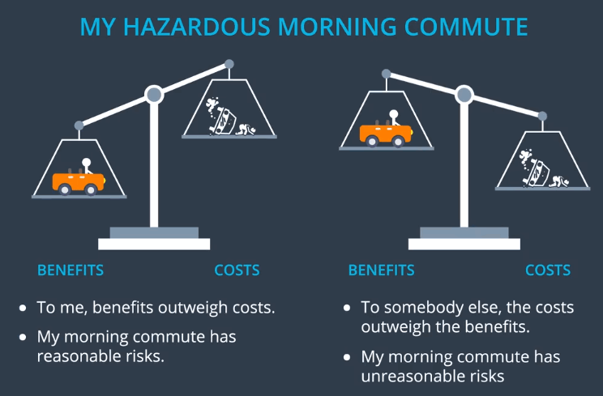

## 汽车安全与汽车功能安全
车辆有许多不同的系统，包括液压系统、机械系统、电气系统、电子系统和化学系统。有各种各样的汽车标准，涵盖了有关安全的主题和最佳设计实践。你可以在汽车工程师协会的网站上找到一些例子。各国政府甚至有自己的安全标准，如美国政府的联邦汽车安全标准和联合国统一汽车管理世界论坛。

功能安全，只关注**电气和电子系统故障**，只是整体汽车安全的一部分。

## 功能安全性和标称性能（Functional Safety and Nominal Performance）
功能安全性也不考虑标称性能。例如，自动制动系统的标称性能可以是车辆以每小时60英里的速度在5秒内完全停止。功能安全不决定车辆是否在5秒内刹车。

相反，**功能安全应该关注的是故障，比如刹车功能在本不应该启动的时候启动了，或者系统刹车太猛导致驾驶员受伤**。标称性能问题仍然可能导致安全问题，但标称性能不是功能安全标准的一部分。

# 4. 什么是功能安全（What is Functional Safety?）
## Video
现在 你需要开始像一名功能安全工程师一样思考，并学会怎样才能使自己的分析变得更加系统化。在功能安全中 你的目标是对可以造成人身伤害的高风险状态进行识别，然后将其风险降低到一个可控并可以接收的范围内。不可控风险的消失就意味着安全。

在最基本层面上 功能安全包含三个要素：
- 第一，识别出会对他人健康造成伤害的潜在问题，我们将这些潜在的问题称为**危害**
- 第二，对危害造成的风险进行评估
- 第三，利用系统工程学的知识将风险降低至一个可以接受的范围内

你必须保证这些危害不会造成任何事故，系统工程学的知识会帮助你得出你设计的汽车需要满足什么样的功能，以及你需要怎样进行设计才能保证汽车安全且合理。实际上第三部分的工作占据了大部分时间，并且它也是功能安全训练模块的主要关注点。降低风险包括设计安全系统，以及测试你所设计的系统并生成设计和测试文档，在第一节课中 我们会让你对这三个模块有一个初步的了解。

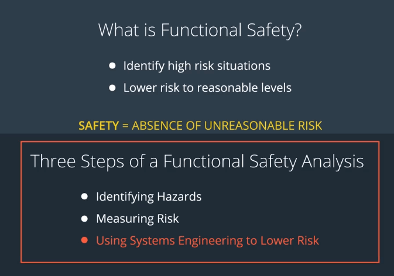

## 功能安全的基础知识:回顾
- **Identify hazards**: 识别客车电子或电气系统中可能对人的身体造成伤害或损害的危险
- **Evaluate the risk of the hazardous situation**: 评估危险情况的风险，这样我们就知道我们需要降低多少风险
- **Systems engineering**: 通过系统工程，将风险降低到合理水平，防止事故的发生。系统工程可以帮助您了解您的车辆需要做什么，以及为了保持安全，您的车辆设计需要什么样的设计。

## 什么程度的风险是合理的?
谁来决定什么程度的风险是合理的?虽然你永远无法完全消除风险，但你将把风险降低到整个社会可以接受的水平。

安全带的历史为社会衡量风险提供了一个很好的例子。另外，请记住，**功能安全只关注与电气和电子系统相关的故障**。虽然安全带是重要的安全特性，但由于安全带是机械装置，所以它们不会被认为是汽车功能安全的一部分。出于我们的目的，我们将考虑安全带是机械的。一些现代安全带，不完全是机械的，而且包含电子元件，将被认为是功能安全的一部分。

许多人认为卡尔·本茨在1885年左右发明了汽车。安全带直到20世纪20年代才开始出现，当时医生开始在他们自己的车上安装安全带。直到20世纪50年代，汽车公司才将安全带作为可选设备提供。直到20世纪50年代末，安全带才成为标准设备。1968年，美国通过了一项法律，要求所有车辆都要系上安全带。1970年，澳大利亚成为第一个要求系安全带的国家。1984年，纽约是美国第一个通过类似立法的州。因此，各国花了近一个世纪才要求使用安全带。

今天，你能想象买一辆没有安全带的汽车吗?按照当代社会的标准，不系安全带开车是一种不合理的风险。但在过去，按照社会标准，不系安全带开车是合理的。**功能安全关注的是将风险保持在当前社会的阈值以下**。

## 完全消除风险
为什么你只是试图将风险降至合理水平，而不是消除所有风险?消除所有风险将使工程、产品开发和测试陷入瘫痪。不幸的是，要确保人们在车祸中不受伤，恐怕是不可能的。另一方面，没有消除足够的风险可能导致失败的产品，召回，诉讼甚至生命损失。最后，每个公司都必须自己决定从产品中消除多少风险。

## “功能性”是什么意思?
术语“功能性”来自于系统工程的一个分支，称为需求工程。系统工程将需求划分为:
- 功能需求——你的**系统应该做什么**;换句话说，系统的功能。
  > 功能要求：form X system **shall do** Y.例如，“转弯信号系统应打开指示灯，告诉司机系统是活动的”。
- 非功能性需求——系统**应该如何表现**:例如，系统有多可靠?
  > 非功能性要求：the form X system **shall be** Y.例如:“当车辆点火开关处于on位置时，转弯信号系统应该是可用的”。

功能安全关注的是当系统做了不该做的事情时会发生什么，这被称为**故障**。您将为车辆设计添加新的工程要求，以确保系统的安全。您可能会注意到，在功能安全模块中经常出现**shall**这个词。这是因为工程需求几乎总是包含“shall”这个词。如果您看到shall这个词，那么您可能正在查看一个工程需求。

# 5. Introduction to Identifying Hazards
## Video
我们刚刚讨论了功能安全的主要目标,即识别危害并将风险降低至可以接受的范围之内.因此 功能安全分析的**首要任务**之一**就是识别可能对人身健康造成损害的潜在威胁**.现如今我们把很多汽车的安全设备的存在当作理所当然，但是，汽车的许多安全设备例如仪表盘、头枕以及挡风玻璃都是在汽车对人们造成实质性的伤亡后才出现的。在功能安全中，我们希望在危害造成伤害之前就对其进行识别，我们不想在其对人们造成伤害之后再亡羊补牢。但是我们怎样才能识别这些潜在的威胁？这需要我们花一番功夫。作为一名功能安全工程师，你将会和自己公司的一批有代表性的员工一起为潜在威胁的识别添砖加瓦，你必须设想许多可能会导致事故的不同场景和情况。为了帮助你更好的识别危害，我们会讨论一下造成事故的三种常见原因：
- 人为操作失误
- 技术失误
- 人机交互失误

在这节课中我们只是对功能安全分析进行简单的介绍，在下面的课程中我们将会为你介绍一个更加正式的框架用于危害识别。

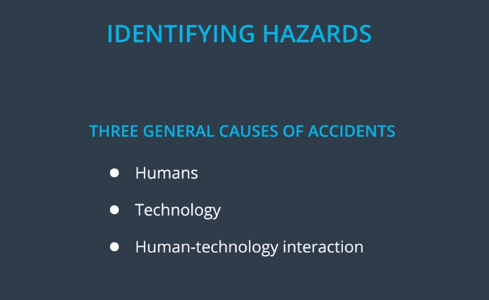

## 人、技术和人-技术交互错误的例子
让我们来看看每种类型错误的实际例子，看看它们是如何导致事故的。

### 人为错误（Human Error）
2016年2月，两列火车在德国慕尼黑附近迎头相撞。虽然这段铁轨上有一个自动信号系统，应该可以让火车停下来，但由于其中一辆火车晚点了，一位控制人员关掉了这个系统。这是人为失误造成的事故。作为一名工程师，你会试图弄明白为什么列车控制人员关闭了系统，以及本可以做些什么来避免这种情况。人为错误在汽车工业中尤其重要。在美国，国家公路和运输安全管理局(National Highway and Transportation Safety Administration)估计，94%的车祸都与人为失误有关。欧盟还估计，约90%的交通事故与人为失误有关。

### 技术失误（Technology Error）
技术引发事故的一个例子是欧洲航天局的阿丽亚娜5号火箭。1996年6月4日，火箭在第一次试飞中爆炸。工程师们重复使用了Ariane 4号软件的部分功能。火箭爆炸是因为Ariane 5需要64位浮点值，而原始软件期望16位带符号整数。软件错误是包括汽车行业在内的许多行业中技术错误的主要来源。在互联网上搜索汽车软件缺陷会让你知道这个问题有多严重。

### 人类技术交互失误（Human-Technology Interaction Error）
最后，我们来讨论一下人机交互是如何导致事故的。2013年，韩亚航空214航班在旧金山降落时坠毁。一名飞行员选择了错误的自动驾驶模式，无意中关闭了自动油门功能。飞机以极低的速度和高度降落。飞行员对自动系统的过度依赖和误解导致了飞机坠毁。自动驾驶系统应该包括一个警告，告诉飞行员自动油门没有保持足够的速度。当人与机器共享对系统的控制时，在评估安全性时需要格外小心;人类应该做什么和机器应该做什么之间的界限需要弄清楚。随着先进的驾驶员辅助系统(ADAS)变得无处不在，人机交互错误可能会变得更加普遍。作为司机，我们需要了解来自车道保持辅助和自动巡航控制系统的警告信号。接口需要清楚地表明，何时车辆需要我们接管。这些需要作为安全问题来分析。我们提到的韩亚航空214航班的例子显示了一个有缺陷的人类技术系统设计的后果。作为一名安全工程师，你的工作之一就是预测当汽车还在设计阶段时，它会出什么问题。您将考虑人类、技术和人-技术交互可能导致危险情况和事故的情况和条件。换句话说，您将识别危险（hazards）。

## 失误和自动驾驶汽车（Errors and Self-Driving Cars）
自动驾驶汽车的目标之一是让人类完全脱离这个等式。权衡的结果是，自动驾驶汽车可能会带来更多的技术错误。以机器学习算法为例。如果行人训练集不包括坐在轮椅上的行人，会发生什么?该系统不包括坐在轮椅上的行人。验证集上的结果需要多精确?谁来决定训练集需要包含什么?自动驾驶汽车技术是如此之新，以至于ISO 26262等标准甚至还没有考虑到与自动驾驶汽车相关的某些问题，比如机器学习算法。但使用系统工程来识别和降低风险的功能安全原则也适用于自动驾驶汽车!请注意，上面的示例处理的是标称性能，这与预期功能(SOTIF)的安全性比FuSa更相关。ISO 26262委员会正在编写一个姐妹规范ISO 21448，以解决标称性能问题。

# 7. 风险评估简介（Introduction to Evaluating Risks）
## Video
既然我们已经明白了如何对危害进行识别，我们需要对每种危害的风险进行评估。在更为正式的功能安全分析中，风险评估会是及其重要的一部分，每种危害都会对应若干种风险。既然我们是从功能安全工程师的角度进行思考，我们就以数值的方式来定义风险。风险可以用其严重程度和其发生概率的乘积定义。严重程度用来衡量在事故中一个人可能受到伤害的严重程度，在乘用汽车的功能安全中，发生概率有一个特定的定义，它是指驾驶员在某种特定的驾驶环境中进行驾驶的频率。

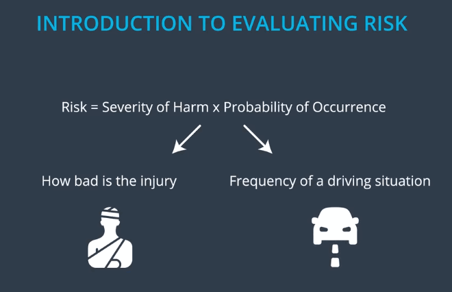

比如，在城市的街道上驾驶时风险的发生概率比较大，因为人们每天都会在这种路况下行车。在积雪的山地中行车有则有着较低的发生概率，因为很少有人会在这种路况下行车。

**发生概率仅仅考虑你在某种特定的驾驶环境中驾车的概率，它并不考虑某一功能失灵可能性的大小**。例如在你行车过程中刹车失灵的可能性，刹车失灵有着很强的严重程度，但是它并不影响发生概率。

让我们学习一个评估风险的例子，
- 我们将严重程度的范围定义为1到4之间，1表示没有伤害 4表示致命的伤害。
- 发生概率的范围也定义为1到4，1代表不太可能发生的情况比如汽车需要跨接启动，而4则代表经常出现的情况，比如在高速公路上行驶。

下面是我们模拟的情景 你行驶在充满积雪的山路边缘并且你的车的动力转向系统失灵，我可以认为严重程度是4因为这辆车会轻易的失控坠下山崖并造成致命的伤害，发生概率可以定义为2因为你很少会在积雪的山路上行驶。风险的数值就等于4乘以2等于8。

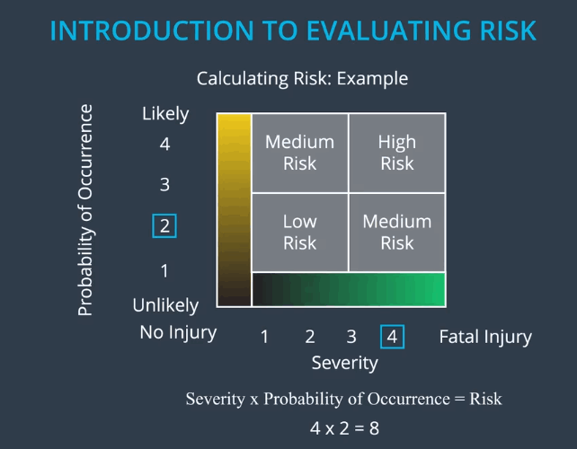

在功能安全分析中我们将风险量化从而确定我们需要在多大程度上降低风险，拥有更高风险的汽车内部系统需要更多的分析和测试从而将风险降低至可以接受的范围之内。

## ASIL (Automotive Safety Integrity Level)

ISO 26262标准定义了一个名为ASIL的风险因素——汽车安全完整性等级。ASIL是ASIL A, ASIL B, ASIL C和ASIL D的四点量表。ASIL D代表风险最高的危险情况，而ASIL A代表风险较低。ASIL是汽车功能安全中的一个重要术语。本视频介绍了ASIL计算背后的基本思想，但我们将把细节留给危害分析和风险评估课。

ASIL A之下还有一个叫做QM的风险级别。QM代表质量管理。质量管理意味着根据公认的质量原则进行开发足以降低风险。在有关危害分析和风险评估的课程中，您将学习更多关于ASIL和QM的知识。

# 8. 降低系统工程风险（Reducing Risk with Systems Engineering）
## 车道辅助系统简介
在整个功能安全模块中，您将使用车道辅助系统作为一个实际的例子。车道辅助系统也将是最终项目的基础。车道辅助技术在汽车领域相对较新。车道辅助系统一般有两个功能:
- 车道偏离警告（lane departure warning）
- 车道保持辅助（lane keeping assistance）

如果司机没有使用转向灯就离开车道，系统会假设司机已经分心，并不是有意离开车道。该系统将震动方向盘(车道偏离警告)，并将方向盘移回车道中心(车道保持辅助)。

车道辅助技术是实现全自动驾驶的中间环节。在本视频中，你将听到有关车道辅助系统、车道偏离警告和车道保持辅助的参考资料。危害分析和风险评估课将更详细地介绍这个系统的工作原理。虽然多个领域使用这个概念中描述的方法，但是我们提供了一个系统工程的例子。系统工程是工程与工程管理的交叉学科，主要研究复杂系统的设计与管理。

## 系统工程基础（The Basics of Systems Engineering） Video

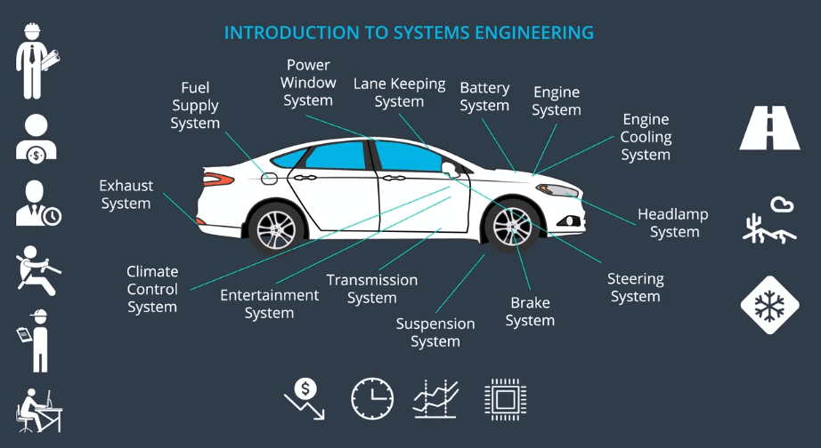

我们已经讨论了如何识别汽车中存在的危害和潜在风险，但是，我们如何才能将风险降精确地降低至可以接受的范围之内？工程师们利用系统工程学的方法降低风险从而防止及管控事故的发生。汽车本身十分复杂，想象一下一辆汽车中包含的所有机械零件、电子器件、液压组件、硬件和软件组件。所有的这些功能都必须在不同的行车条件下相互协调，运转良好。比如在高速公路上行驶，在沙漠里的热浪中行驶以及在冻结温度之下行驶。

现在，想想在参与一辆汽车的设计和生产过程中形形色色的人，产品工程师，财务经理，项目经理，安全工程师，测试工程师以及车身设计师。当这些人了解到所设计车的用途之后，他们会在这辆车的设计中增添一些各自的限制因素。比如说，一个产品工程师会倾向于让车道保持系统始终处于开启并可以使用的状态。一名安全工程师会找出在什么情况下车道保持系统应该关闭或者限制使用，除了安全以及可用性方面的限制因素之外，其他的限制因素包括成本，生产能力，市场需求以及当前技术的限制。

在这里系统工程学开始发挥作用，系统工程学会提供一个系统化的框架用来得出你的汽车要实现什么功能，它又被叫做**需求工程**。想出一个符合你自己的需求的设计，并将需求分配给你设计中的不同部分，这一过程称为**系统结构设计以及分配系统需求**。对你设计的系统进行测试和验证从而确保其按照设计正常运转，这个过程我们称之为**测试和验证**。最终，将不同的部分整合在一起从而确保所有部件能够共同运行良好，这一过程被称作**系统集成**。

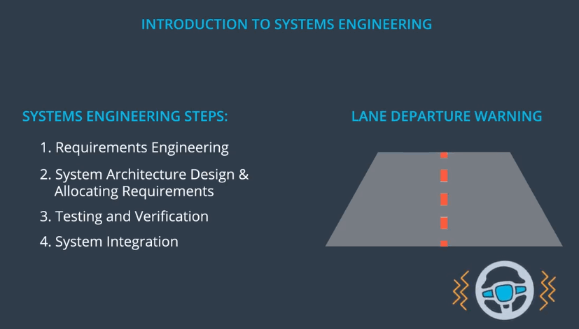

我们如何使用系统工程学，我们假设一个产品工程师团队在进行偏离路线警示功能的设计，当驾驶员驶入错误的车道时，设计的警示功能会震动方向盘，而你作为一名安全工程师，在审阅了所有有关路线纠错功能的设计之后，迅速意识到如果方向盘震动的太猛烈，会使司机失去对车辆的控制并引发车祸。

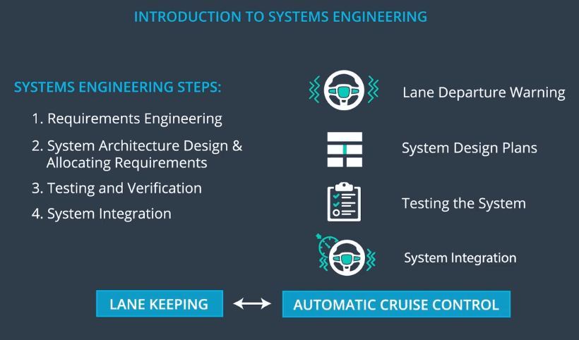

针对这个问题你要做些什么？你会利用系统工程学的相关知识。
- 首先，思考出汽车需要做出什么样的改进。汽车必须对方向盘的最大震动幅度进行限制，如果震动幅度超过了这个限制，偏离路线警示功能必须关闭，这就是**需求工程**。
- 现在，你对路线纠错功能的设计进行改进，加入你所设计的新功能，我们把这个过程称之为**分配系统结构需求**。
- 接下来，你需要对你的设计进行**测试**从而保证其正常运转，通过**验证**可以发现当震动过于剧烈时该功能确实会关闭。这就是**测试和验证阶段**。
- 最后，将你的设计和这辆车的其余部分组合在一起。例如，你要保证这个偏离路线警示系统和自动巡航系统兼容良好，这一步叫做**系统的集成**。

作为一名功能安全工程师你的职责就在于，当你的公司设计一款汽车时将自己的想法融入设计之中并进行测试验证，你会用到系统工程学的知识指导你的工作。

## 系统是什么？（What is a System?）
系统到底是什么?国际系统工程委员会将系统定义为一种由不同元素组合而成的结构或集合，这些结构或集合产生的结果仅由这些元素独自时无法获得。元素或部件可以包括人员、硬件、软件、设施、策略和文档;也就是说，产生系统级结果所需的所有东西。

诚然，系统的定义有点难以确定。对于本模块其余部分的目的，系统将是提供某些功能的工具的一部分。我们将特别关注一个高级驾驶员辅助车道保持系统的简化版本，该系统可以帮助驾驶员保持在车道的中心。

## V模型（The V Model）
为了组织系统分析，系统工程师使用所谓的过程模型。这些过程模型为进行系统分析提供了一个框架。

ISO 26262使用一个称为V模型的过程模型。在介绍ISO 26262及其特定版本的V模型之前，让我们先讨论通用V模型的特性。

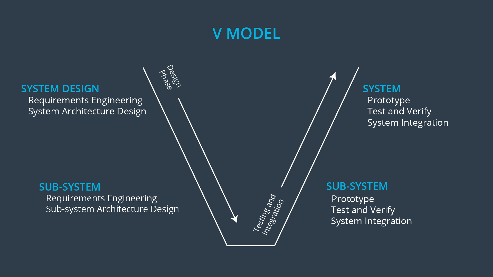

**V模型左边（Left Side of the V Model）**

V模型从左上角开始，向下移动到底部的中心，然后再向上移动到右上角。V的左侧表示设计阶段; 这就是你：
- 计划您的系统需要做什么(需求工程)
- 计划系统需要什么样子(系统架构设计)。

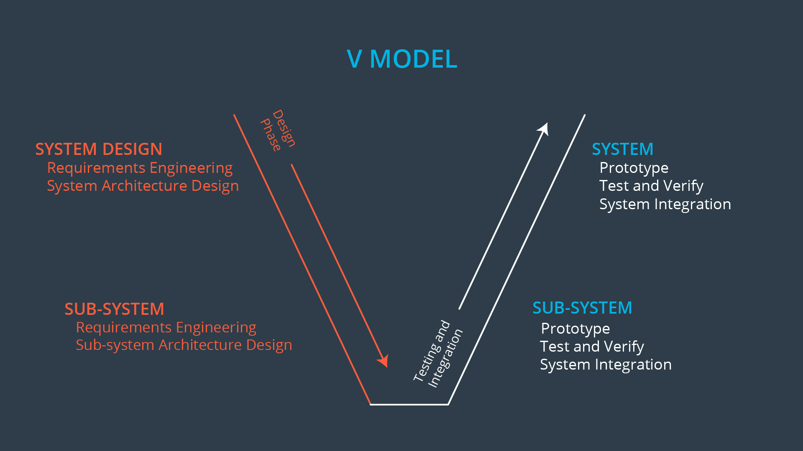

**V模型右边（Right Side of the V Model）**

V的右侧表示测试、验证和集成;在右侧，您构建原型并测试和验证原型，以查看它们是否按照您所说的在设计阶段将原型与车辆的其他部件集成在一起。

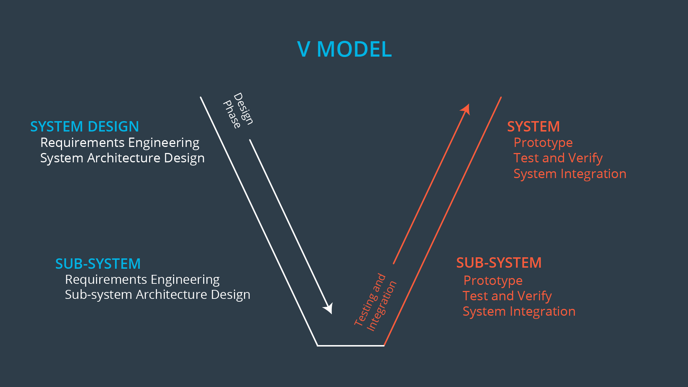

V的顶部部分表示整个车辆作为一个单一的系统。当你沿着V的左边走的时候，你的注意力集中在越来越小的子系统上。当你沿着V的右边走，你把你的子系统集成到越来越大的系统中。

在左上角，你可以鸟瞰你的整个汽车。当你从左边向下移动时，你开始把你的车分成子系统，比如温度控制系统、娱乐系统、转向系统、刹车系统等等。然后为每个子系统定义需求和系统架构。

然后你把注意力集中在一个子系统上，比如温度控制系统，把温度控制系统分解成它自己的子系统，比如电子控制单元、温度传感器、风扇、空气过滤器等等。每个子系统都有自己的设计需求和设计体系结构。

还请注意，您可以连接V的右侧和左侧。对于您制作或测试运行的每个原型，您都可以检查结果是否符合设计规范。

**连接左边和右边（Connecting the right and left side of the V）**

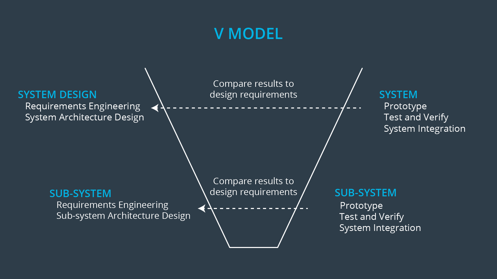

## Other Process Models

另外两个流行的流程模型包括螺旋模型和瀑布模型。然而，它们不是ISO 26262标准的一部分。虽然我们不会在功能安全模块中介绍它们，但是这两个模型在系统工程中也经常使用。

# 9. ISO26262简介（Introduction to ISO 26262）
## Video
现在 你已经具备了识别功能安全评估风险的基础，并学会了利用系统工程学的知识来降低风险。现在我们要学习国际功能安全标准 即ISO 26262。

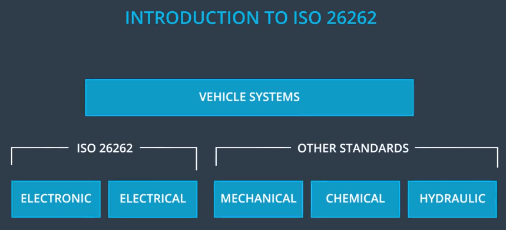

ISO 26262提供了一个框架，用来处理**乘用汽车电子系统失灵**，换句话说 这个标准可以确保当你设计的汽车内部系统，即便无法根据设计正确运行也不会对他人的健康造成伤害。

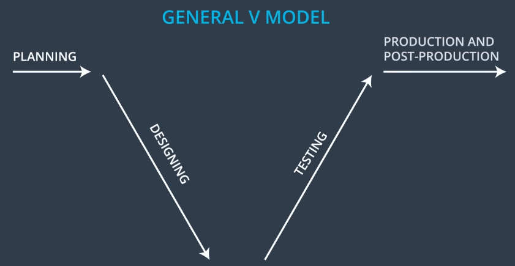

回忆一下我们前面学过的V模型，ISO26262利用V模型来确保汽车整个生命周期的安全性，包括汽车的规划，设计，测试，生产以及后期工作。

让我们看一下这个V模型，它比我们之前学习的V模型稍稍复杂一点，但原理是相同的。

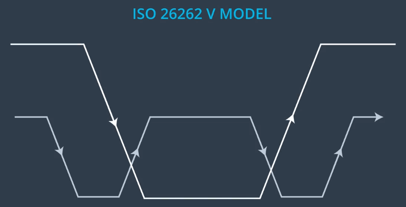

- 左面部分代表系统的规划和设计

  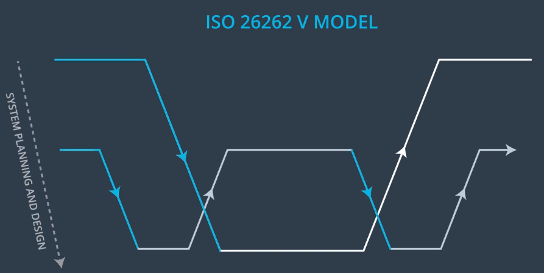

- 右面部分则表示系统的测试和集成

  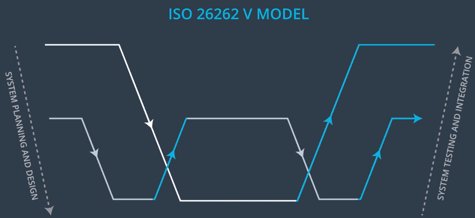

- V的底部代表各个子系统

  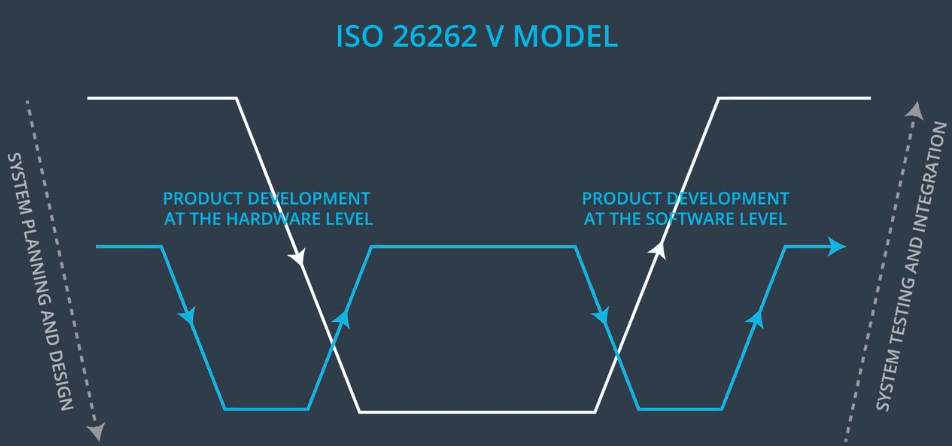

- 其上部代表集成后的系统
  
  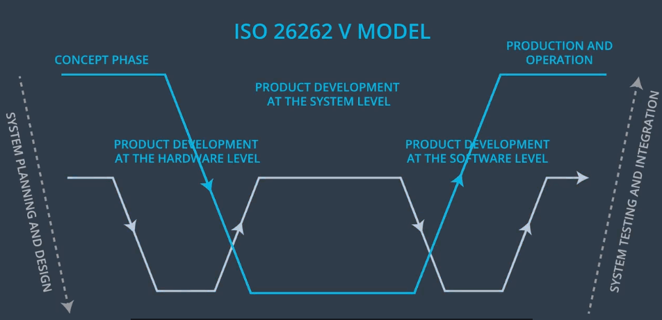

我们可以注意到V模型清晰的区分出了硬件和软件的开发。在高一级模型之下的**每个子模型都有自己专属的小型V模型**，

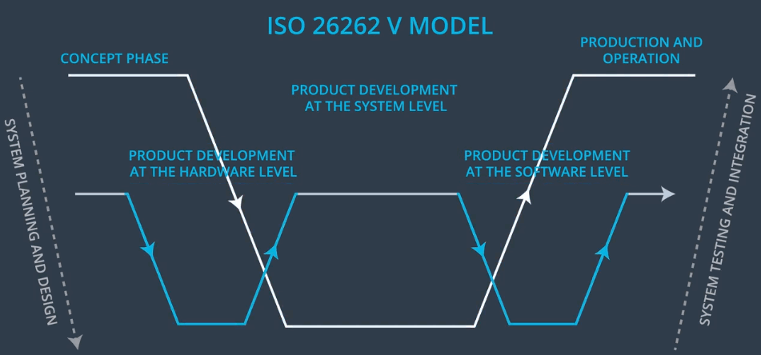

还有一点值得注意的是你可以用横线将V模型的左右两边连接起来，对于每一个集成和测试的步骤，你可以进行回溯并确认正在开发的产品符合其设计特性。

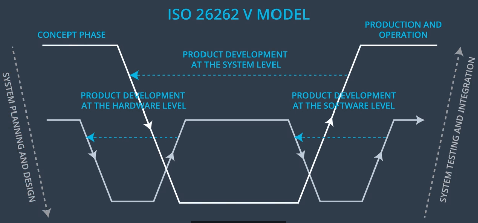

在剩下的课程中，我们会详细的学习**规划和设计**这两个步骤，我们将重点关注V模型的这些部分，我们将以车道保持系统为例，从系统的层面上，学习产品的初步设计以及开发，并从软件和硬件的层面上学习产品的开发，你将会初步了解到在汽车内部模型的设计中怎样做才能够使设计满足ISO 26262标准。

## What ISO 26262 Does and Does not Cover

ISO 26262只适用于**客车系统中的电子和电气故障**。该标准为降低可能危害人们健康的风险提供了一个框架。

本标准不包括机械、化学或液压系统的安全。该标准也没有将标称性能视为功能安全性的一部分。

以自动制动系统为例。标称性能可能是当车辆检测到即将发生的碰撞时自动刹车。该标准不要求你测试标称性能，并证明即将发生碰撞时刹车啮合。相反，该标准将要求防止故障，比如在没有紧急情况时自动刹车失灵。然而，可能还有其他标准或法律涵盖汽车安全系统的标称性能。

## Overview of the Concepts to be Covered
功能性安全的很大一部分是文档化您的工作。让我们概述一下这些文档是什么，以及它们如何与功能安全性相关。接下来的几节课将更详细地介绍**每个文档**。

### Safety Plan
安全计划概述了如何实现安全系统。主要内容包括:
- what system is under consideration
- the goal of the project
- what steps will be taken to ensure safety
- the roles and personnel involved in the project
- the project timeline

### Defining a system at the Item level
指定正在考虑的车辆系统、系统边界和有关系统的背景信息。

### Hazard Analysis and Risk Assessment
这是我们头脑风暴的地方，想象危险，在那里系统失灵，造成伤害或伤害。然后计算每个危险场景的风险。

### Functional Safety Concept
功能安全概念提供了系统的高级概览。根据危害分析和风险评估，确定系统需要做什么才能保持安全。然后确定需要调整系统的哪些部分，以考虑新功能。

### Technical Safety Concept at the System Level
功能安全概念与技术安全概念相似。功能安全概念对系统及其需要做的工作提供了一个高层次的概述，而技术安全概念则更加详细。

因此，虽然功能安全概念可能对“车道警告偏离方向盘的振动应该受到限制”提出了很高的要求，但技术安全概念将讨论电子信号和控制单元需要如何表现才能限制方向盘的振动。

技术安全概念通常分为系统级技术安全概念和子系统级技术安全概念。例如，电子控制单元可能有自己的技术安全概念。

为了阐明上述概念，**功能安全概念是独立于实现的，只考虑功能级架构。技术安全概念考虑系统的实施水平**。

## Why Comply with ISO 26262?
在法律上并不要求遵守ISO 26262。但大多数(如果不是所有的话)汽车公司和汽车零部件供应商都在努力使自己的产品符合标准。该标准提供了一个系统的，最先进的框架，以确保一个安全的电气/电子系统。

## What is ISO?
ISO代表国际标准化组织。ISO是一个非政府组织，为各种行业开发和提供产品和系统规范。标准确保世界各地的不同制造商使用最佳实践。

## Vocabulary
功能安全标准包含了大量的词汇。功能安全中经常出现的一个重要词汇是故障（fault）、失效（failure）、危险（hazard）和风险（risk），如果您能从一开始就记住这四个术语，那么功能安全模块将更容易理解。

Fault指系统发生不适当的事情，例如缺陷或意外行为，Fault可以导致故障，这是malfunction的同义词。Failure意味着系统已停止正常工作。系统不再做它应该做的事情。Failure可能导致Hazard，
hazard是一种可能对人造成伤害或损害人的健康的情况。如果系fails，则情况可能很hazardous。并不是所有的failures都是hazardous，这意味着hazard有不同等级的Risk。Risk衡量的是一种情况下的危险程度。高风险情况的一个例子是，它很可能发生，也会造成严重的伤害。

例如，如果您的汽车无线电硬件中的一个电阻坏了，就可能导致fault。收音机开不了，所以failed。failure会导致hazardous情况吗?可能不会。你不能听音乐，但这不会对你的身体造成伤害。

如果动力转向硬件中的电阻损坏，动力转向可能会fail。如果你在高速驾驶，那么你可能会受重伤。所以这是一个高风险的hazardous情况。

- Faults leads to failures.
- A failure leads to a hazard.
- A hazard has a certain a level of risk.

# 10. The Full V Model
## Full V Model
如果您在internet上搜索ISO 26262v模型，您会发现它比我们所展示的要复杂一些。这个[链接](https://webstore.ansi.org/preview-pages/ISO/preview_ISO+26262-10-2018.pdf)预览了ISO 26262标准，它包含了完整的V模型。

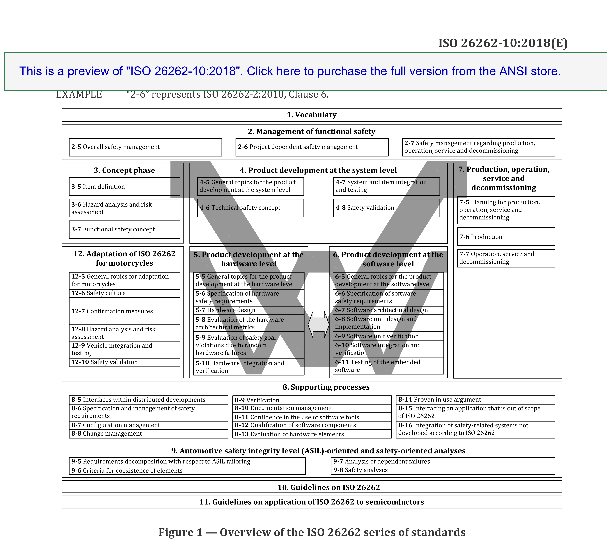

您会注意到，到目前为止，我们所提供的模型已经稍微简化了。这是我们在之前的视频中展示的模型:

通过功能安全课程，您将熟悉ISO 26262v模型的不同部分。请记住，虽然ISO 26262模型看起来相对复杂，但V模型的基本原则是相同的:
- 左边表示产品开发，比如指定需求和设计系统架构
- 右侧表示原型、测试和集成
- 在V模型的较高位置表示集成系统
- 在V模型的下面代表子系统

## 词汇表

本节包含完整的ISO 26262v模型的每个部分的定义。功能安全模块深入介绍了以下几个部分:项目定义（item definition）、危害分析和风险评估（hazard analysis and risk assessment）、功能安全概念（functional safety concept）、技术安全概念（technical safety concept）、软硬件开发（hardware and software development）:

### **Management of Functional Safety**

在这里，标准讨论了总体规划。计划包括设计一个safety plan，你将在safety plan课上学到。

### 初步设计阶段（Concept Phase）
初步设计阶段包含4个部分：
- Item definition: 项目定义详细说明了要考虑的车辆系统。危害分析和风险评估课更深入地介绍了项目定义。
- Initiation of the safety lifecycle： 如果您的项目只涉及修改一个现有的系统，那么您可以确定哪些功能安全部分将受到影响。这样，您就不必重复已经完成的工作。
- Hazard analysis and risk assessment：在危害分析和风险评估(HARA)中，您可以找出系统可能出现故障的情况，然后评估风险。HARA的输出是高水平的工程要求，称为safety goals。
- Functional safety concept：本节将safety goals细化为安全需求。然后将这些安全需求分配到项目架构的适当部分。

### Product development at the system level
这是主要的设计阶段。您将开发一个技术解决方案，从而实现一个安全的系统。在本节中，您将根据V模型的左侧指定技术安全要求、系统架构和系统设计。然后根据V模型的右侧对系统进行 test, integrate, verify and validate。

### Product development at the hardware level
根据系统级的技术要求，从上一步开始，开发硬件。硬件开发过程有自己的V模型;硬件设计发生在分支的左侧。V模型的右侧包括集成和测试。

### Product development at the software level
同样，基于系统级的技术需求，您可以开发软件。软件也有自己的V模型，左边是设计，右边是集成和测试

### Production and Operation
本节分为两部分:
- **生产**：讨论与车辆制造(生产)相关的功能安全性。这部分还讨论了一旦车辆在消费者手中(**操作**)，应该记住什么。
- 操作、服务(维修保养)、退役操作是客户购买车辆后的功能安全。服务是指车辆维修保养时的功能安全。退役讨论的是车辆不再服役时发生的情况。

### Supporting processes
支持流程包含多种不同的技术。例如，支持流程部分讨论了如何更改已经存在的系统。它还提供了管理安全需求的策略。

### ASIL-oriented and safety-oriented analysis
本节将深入介绍ASIL分解和其他分析工具。您将在本模块中了解ASIL分解。

### Guideline on ISO 26262
本节概述功能安全标准。
## Flattened V Model
您还可以将V模型平展，以便从更线性的角度观察它。下图给出了功能性安全项目的主要步骤:

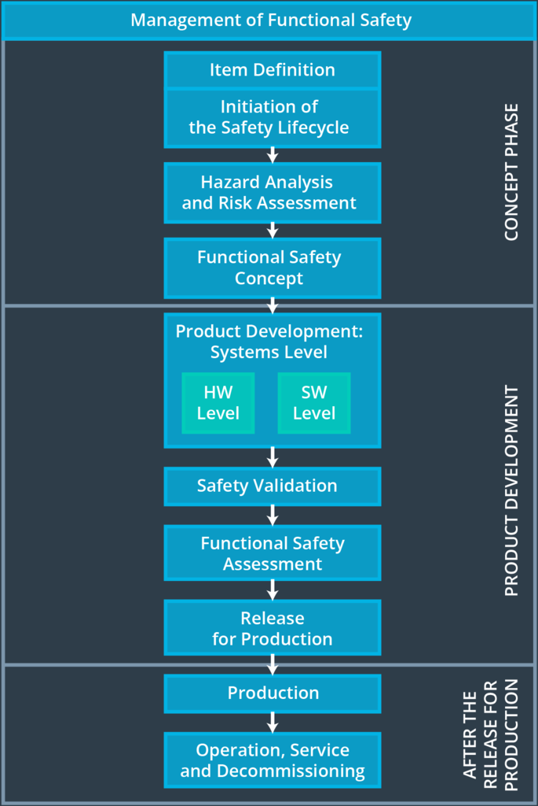

# 11. Summary
## Video
在开始下一课的学习之前，我们先来总结一下前面我们学习了哪些内容，安全意味着将风险降低到合理的范围之内，我们通过识别出那些可能会导致事故的危害来维护系统的安全性。然后我们对每种危害可能造成的风险进行评估，最后 我们利用系统工程学的知识将风险降低至可接受的水平。

当今的社会定义了什么是可接受的风险，汽车工业中的功能安全，特指降低电子系统中的风险，ISO 26262标准是汽车功能安全的指导方针，它是一个标准的哲学意义上的模型。在下一节课，我们将会讨论安全计划，这个安全计划告诉我们如何做可以获得功能安全。

## 功能安全概述
ISO 26262功能安全标准遵循V型。在功能安全方面，按照标准，功能安全包括以下四个主要步骤:
- 需求工程定义了系统将要做什么
- 设计或修改系统架构，设计系统。
- 测试系统，确保它的行为符合预期
- 将系统集成到更大的系统中

请注意，需求工程活动在V的左侧的所有级别上执行，并在ISO 26262-8中进行了描述

## 功能安全模块是关于什么的
本模块主要集中在V模型的左侧，包括功能安全系统的规划和设计。您将扮演一个功能性安全经理的角色。记住这只是V模型的一半。V模型的右侧涉及到通过软件和硬件工程实现计划和设计。还需要对实现进行测试，以确保它们遵循V的左边的设计规范。
