# 1. Introduction

## Video
在利用 ISO 26262标准下对一个系统进行分析之前，你需要制定一个计划。设计一个安全的汽车不仅仅需要对其硬件和软件系统进行详尽的分析。汽车是具有社会属性要求和技术属性要求的复杂的系统组合，如果你的公司或者团队根本不注重安全，又怎么可能设计出一辆安全的汽车呢？如果角色和职责的分配含糊不清，一些重要的设计步骤可能会被忽略，所以功能安全的第一步是起草一个安全计划。安全计划迫使我们对角色进行定义，然后勾勒出达到功能安全所需的步骤，在这节课中我们将会教你一些安全计划的基础部分，从而让你自己也可以起草自己的安全计划。

## 课程大纲
在本节课中，你将学习记录一个功能安全计划（safety plan）。这是一个功能安全经理经常执行的任务。一旦你理解了文档背后的动机，你就会了解安全计划的不同部分:
- Safety Culture 安全文化
- Safety Lifecycle 安全生命周期
- Safety Management Roles and Responsibilities 安全管理的角色和职责
- Development Interface Agreements 开发接口协议
- Confirmation Measures 确认措施

虽然其中许多术语可能看起来很陌生，但是随着本课和本模块其余部分的学习，您将逐渐熟悉它们。安全计划的某些部分比其他部分更直观。例如，项目进度计划将是一个日历。另一方面，填写确认措施部分的大部分内容需要有关测试和验证的知识，这些知识超出了模块中所涵盖的范围。

ISO 26262标准的第2部分，功能安全管理，定义了安全计划。注意，安全文化、安全生命周期、开发接口协议和确认措施是重要的**安全计划元素**，但不是ISO 26262定义的“安全计划”**工作产品**的一部分。相反，它们被认为是独立的工作产品。ISO 26262允许定制安全计划流程，其中包括多个工作产品。

## Safety Plan Outline 安全计划大纲

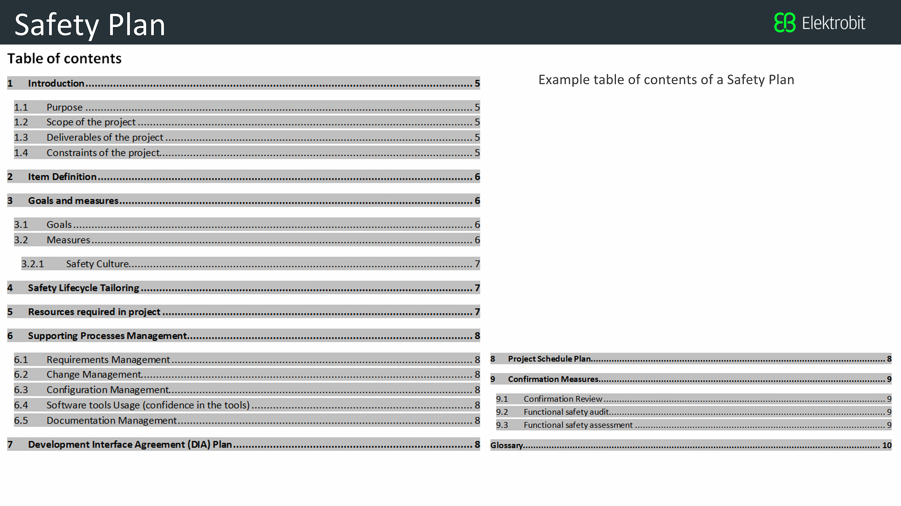

本模块末尾的项目需要编写安全计划。读完这节课，你就可以准备写安全计划了。以下是各部分的概览:
- 引言（Introduction）部分概述了该项目，并讨论了将包含在整个报告中的文档。
- 项目定义（Item Definition）描述了将要分析的特定车辆系统。
- 目标和度量（Goals and Measures）讨论项目的目标以及将包括哪些活动。
- 安全生命周期裁剪（Safety LifeCycle Tailoring）提到了V模型的哪些部分将包含在项目中。
- 项目所需的资源（Resources Required In Project）定义了团队中的不同角色。
- 支持过程管理（Supporting Process Management）讨论了将要使用的系统工程管理方法。
- 项目进度计划（Project Schedule Plan）给出任务何时完成的日历。
- 确认措施（Confirmation Measures）报告将采取什么措施来证明功能安全已经实现。

在最终项目GitHub存储库中，您将找到一个[模板](https://github.com/udacity/CarND-Functional-Safety-Project)，用于在最终项目中制定的安全计划。您可以在学习安全计划课程时查看模板。

## Why Document?
ISO 26262要求独立审计。审计检查项目是否遵循标准中列出的步骤。审核员将依靠文件来评估你的工作。审计后可进行安全评估，用于确定所作的决定和采取的步骤是否达到适当的安全。

文档还提供了修改系统时的参考。例如，如果您正在修改制动系统，您可以使用以前的文档来帮助指导当前的项目。

如果你参与设计的汽车被出售给公众，然后出现安全问题，会发生什么?政府当局可能希望看到有关该系统如何设计和测试的文件。你要证明你遵循了最佳实践。证据在文件中。

**功能安全的主要目标是将风险降低到可接受的水平**。但是，您如何证明您的设计解决方案实际上降低了风险呢?就像律师在法庭上为案件辩护一样，你会在一份名为“safety case”的最终文件中提出你的论点。安全案例(safety case )将提供证据，证明您的项目已使车辆更安全。证据将包括所有ISO 26262文件，如安全计划、设计计划、功能安全概念、技术安全概念，以及证据文件的测试和集成。安全案例将讨论您向系统添加了哪些元素，以确保系统的安全性。它将提供测试证据，表明系统运行正常。文档提供的证据表明，您添加到系统中的内容确实使车辆更安全。完全独立于功能安全团队的人员应该评估安全案例的有效性。

# 2. Good Safety Culture 
## Video
技术上出现的失灵并不是造成车祸的唯一因素，明确这一点十分重要。社会性的和组织上的因素也同样起作用，一个组织应该制定清晰的政策来支持安全系统的开发、生产和运营。

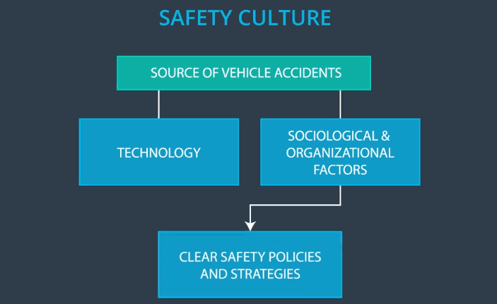

试想如果你的经理让你跳过若干个软件集成测试步骤从而省下时间从而按期完成这个项目会发生什么？你是否会理直气壮的拒绝经理的这一要求？

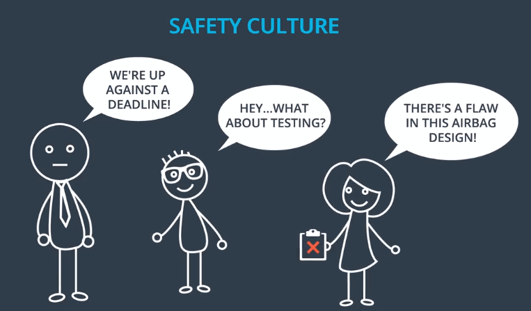

你的公司是否有着清晰的政策规定了当你遇到一个不在你责任范围内的问题时该怎样做？毕竟所有技术上的决定都是由人做出的，而每个人都可能犯错，一个好的安全文化会将安全性置于最高的优先级之上，远高于其他的竞争性因素。例如成本和生产率。做出的决策应该详细的记录在案并可以追溯到做出这个决定的人的身上。公司应该对安全的系统设计进行奖励并对缺陷的设计进行惩罚，没有一个好的安全文化，功能安全就是一纸空文。你的安全计划需要包含关于你的公司如何提升企业安全文化的信息。

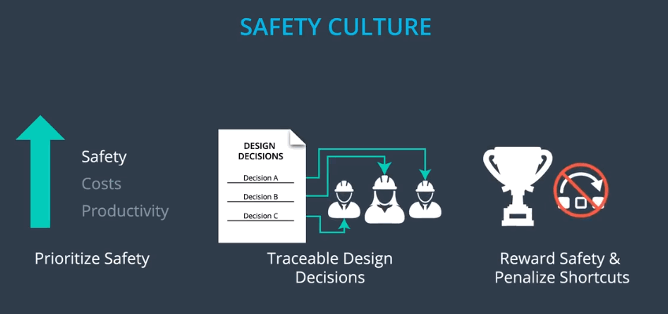

## 良好的安全文化
以下是良好安全文化的一些特点:
- 高优先级（High priority）:在成本和生产力等相互竞争的约束条件中，安全性具有最高的优先级
- 问责制（Accountability）:流程确保问责制，这样设计决策就可以追溯到做出决策的人员和团队
- 奖励（Rewards）:组织激励和支持功能安全的实现
- 惩罚（Penalties）:组织惩罚危害安全或质量的快捷方式
- 独立性（Independence）:设计和开发产品的团队应该独立于审计工作的团队
- 定义良好的流程（Well defined processes）: 公司的设计和管理流程应该明确定义
- 资源（Resources）:项目拥有必要的资源，包括具有适当技能的人员
- 多样性（Diversity）:追求知识的多样性，重视知识的多样性，并将其融入过程
- 沟通（Communication）: 沟通渠道鼓励问题的披露

## Quality Management 质量管理
ISO 26262不直接涵盖质量管理;然而，质量管理是安全文化的必要组成部分。组织需要有一个符合ISO/TS 16949等质量管理标准的质量管理体系(2016年被IATF 16949或ISO 9001取代)。

# 3. Tailoring the Safety Lifecycle

我们再来学习一下 V 模型中包含的一些步骤，V模型展示了整套安全生命周期，从理念阶段开始然后经过产品开发阶段并在生产阶段终止。总体而言，一名功能安全工程师需要对整个周期进行协调和记录。

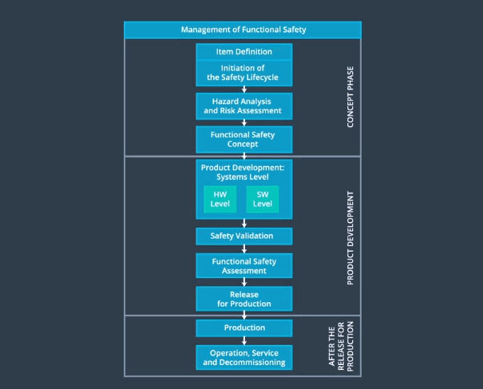

扪心自问一下，究竟我的产品是前所未有的还是我仅仅是在改进一个已经存在的产品？如果你在设计一个新的产品，你必须对整个安全生命周期进行跟进和记录。

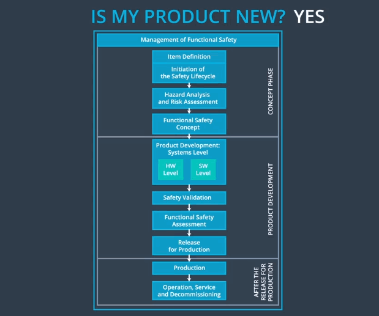

如果你是在改进一个已经存在的产品，那你大可不必在安全生命周期中使用所有的步骤，新的功能可能只会影响理念阶段和生产开发阶段其中的一小部分。

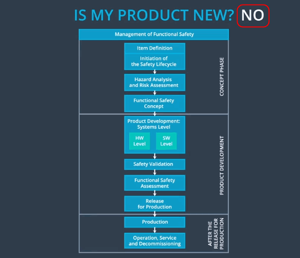

所以你可以对安全生命周期进行裁剪使其只包含受新功能影响的部分。通过这种方法，你可以重复使用之前工作取得的成果。

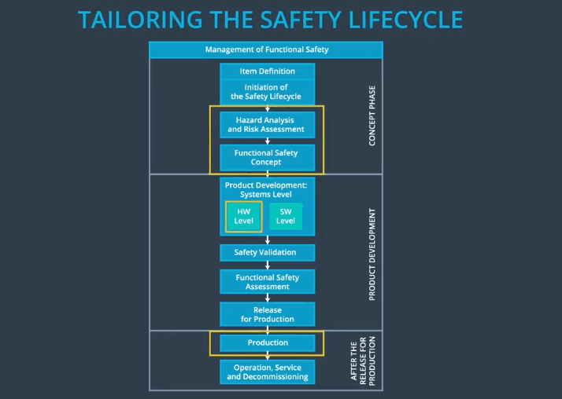

比如，你在对一个已经存在的自动刹车系统进行改进，你的公司已经决定使用一种新的电子控制单元，其处理器运算速度更快且性能更强的.

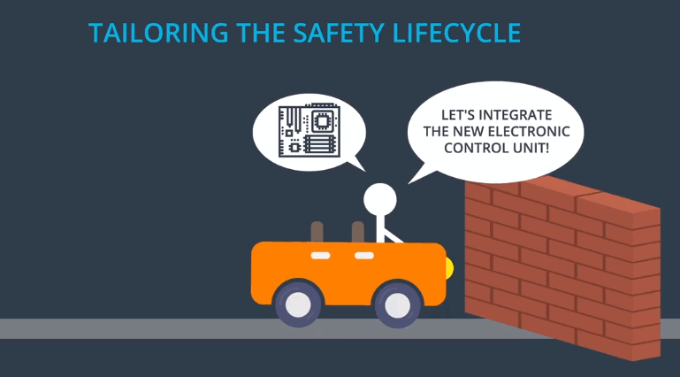

然而，这个刹车控制系统本身的功能没有改变。首先你需要确定新的电子控制单元对刹车系统没有影响，如果确实没有影响的话，你基本上对设计不用做任何修改。你可以重复使用之前功能安全分析的部分内容。但是 你依然需要进行测试从而保证新的电子控制单元和其余的系统集成良好.

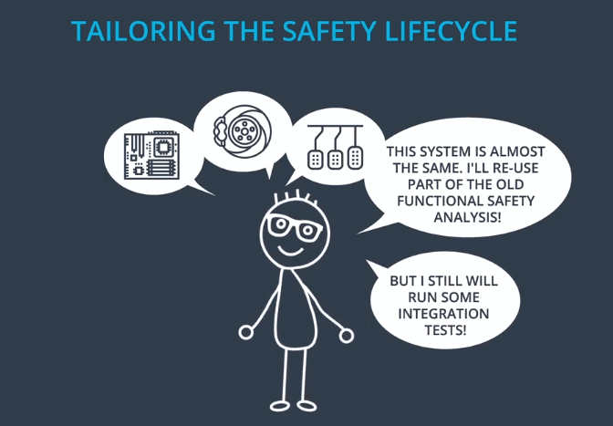

在安全计划中，你需要讨论正在开发的产品究竟是全新的还是仅仅只是对已有的修改，接下来对安全生命周期进行裁剪。并讨论V模型中的哪一部分需要包含在其中，对安全生命周期的裁剪过程使得你关注产品中较为新颖的一部分。

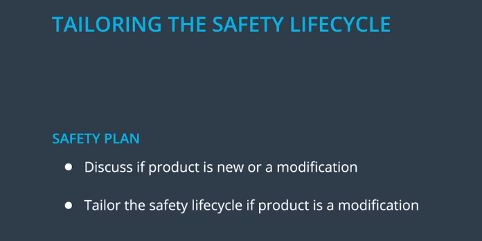

# 4. Safety Management Roles and Responsibilities 安全管理的角色和职责

## Video
安全计划的另一部分是指角色和责任的定义。ISO 26262标准规定，全部工作不能只由一个人完成。

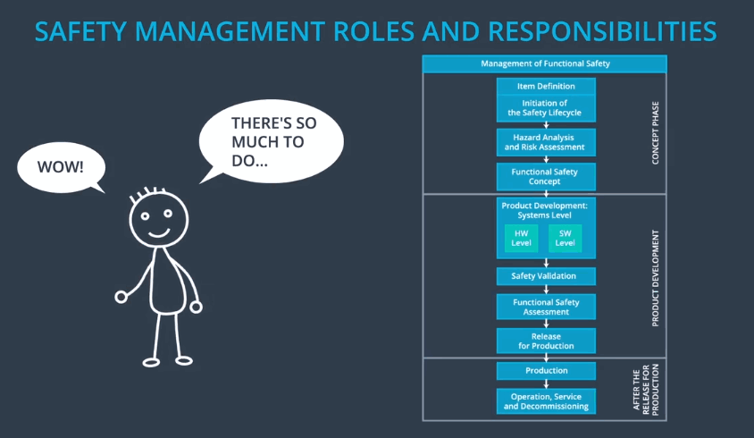

事实上，开发一个产品的安全功能模块需要多个团队共同努力，这些团队成员可能来自一个公司也可能来自不同的公司。在一个和安全性有关的项目中 一些最重要的角色包括：
- 项目经理：其作用为确保项目中所有必要资源的充足性
- 安全经理：其职责主要在于书写安全计划，并按计划对项目进行监控
- 安全工程师：其主要负责架构的设计以及一些应用步骤的设置，例如集成和测试
- 安全审核员：其职责为确保公司完全按照功能安全标准安排相关生产步骤
- 安全评估员：相当于一个独立的评审来判断该项目生产的汽车是否安全
- 测试经理：其职责为设计测试程序，用来测试设计出的系统是否能够按照期望运行

在安全计划中对这些角色准确的定义，确保了团队中每一个人对都清楚自己需要做哪些工作。定义角色也意味着每一项任务都会由一名团队的成员承担。

## Major Roles and Responsibilities in Functional Safety
团队中的每个人最终都要负责遵循安全流程，而不管他们在公司中的角色是什么。创造和维持安全文化也将是每个人的责任;然而，如果你是一名安全经理，那么你会对确保一个以安全为导向的工作场所特别感兴趣。

下面是功能性安全项目中不同角色的摘要：
- Project Manager 项目经理：整体项目管理，获取和分配功能安全活动所需的资源，任命安全经理或可能担任安全经理
- Safety Manager 安全经理：计划、协调和记录安全生命周期的开发阶段，定制安全生命周期，维护安全计划，根据安全计划监控进度，在安全审核员面前进行预审核。
- Safety Engineer 安全工程师：产品开发，集成，在硬件、软件和系统级别进行测试。
- Safety Auditor 安全审计：确保设计和生产执行符合安全计划和ISO 26262。必须独立于开发项目的团队
- Safety Assessor 安全评估员：关于是否通过功能安全评估实现功能安全的独立判断，必须独立于开发项目的团队。
- Test Manager 测试经理：计划测试活动，协调测试以显示车辆系统工作正常

这些是功能安全生命周期中的主要管理角色;还会有其他人参与其中，包括需求工程师、测试工程师、硬件工程师和软件工程师。

## 关于已定义角色的说明
ISO只定义了program manager and safety manager。然而，使用其他角色是一种可能的实现，并且可能因公司而异。

# 5. Development Interface Agreement
## Video
汽车的供应链可以分为三部分：原始设备制造商（OEM），一级供应商和二级供应商。

OEM是原始设备制造商（Original Equipment Manufacturer）的缩写，它们是将车卖给消费者的那些品牌公司。但是原始设备制造商并不独自开发所有的汽车系统，它们将一些开发任务外包给一级供应商。这样原始设备制造商和一级供应商就形成了一种客户和供应商的关系。

原始设备制造商可能会提供一些关于汽车系统功能的要求，并由一级供应商为其进行开发和生产，或者原始设备制造商提供一个产品的初步设计并由一级供应商来完善细节。

一级供应商有时候会将它们的工作外包给二级供应商。一个常见的例子是一个一级供应商一个电子控制单元外包给了一家二级供应商公司，接下来，这个一级供应商利用这个电子控制单元为原始设备制造商开发了一个自动刹车系统。

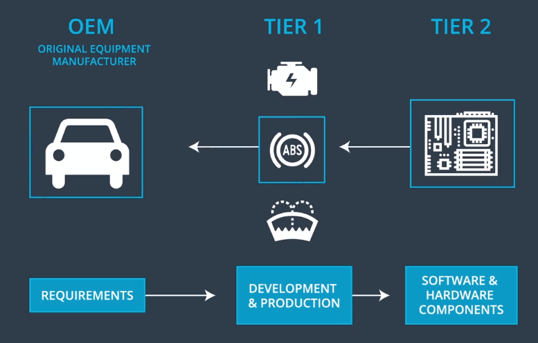

在安全计划中，有一章叫做接口协议开发（DIA），接口协议的开发规定了原始设备制造商和一级供应商或者一级供应商和二级供应商之间设计以及生产方面相应的责任，我们为什么要将接口协议开发纳入安全计划？其中的一个原因是为了避免在产品的计划和开发过程中产生争执，另外一个原因是可信度。如果一辆车在出售给顾客之后存在安全问题，接口开发协议清楚的规定了哪家公司应该承担修复系统的工作。

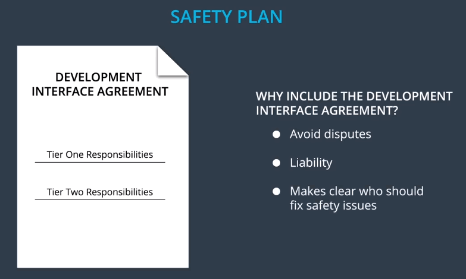

## What Goes into a DIA (Development Interface Agreement)? DIA(开发接口协议)包含哪些内容?
DIA(开发接口协议)定义了参与开发产品的公司之间的角色和职责。在计划开始前，所有有关各方须就计划的内容达成协议。DIA还规定了双方将提供什么证据和工作产品来证明工作是根据协议完成的。最终目标是确保各方都在开发符合ISO 26262标准的安全车辆。

以下是DIA的主要部分:
- 客户和供应商安全经理的任命
- 安全生命周期的联合定制
- 客户应执行的活动和过程;
- 由供应商执行的活动和过程
- 要交换的信息和工作产品
- 负责设计和生产活动的各方或个人
- 任何支持流程或工具，以确保客户和供应商技术之间的兼容性

# 6. Confirmation Measures 确认措施

## Video
我们要讨论的安全计划的最后一部分叫作认可措施。认可措施主要确认三件事情：
- 首先确认我们项目的整个过程符合功能安全标准
- 其次，确保我们项目严格按照安全计划执行
- 最后，证实设计的功能确实可以提升安全性能

这些措施的制定者没有参与过产品的设计和应用过程，安全计划会规定采取何种具体的措施。

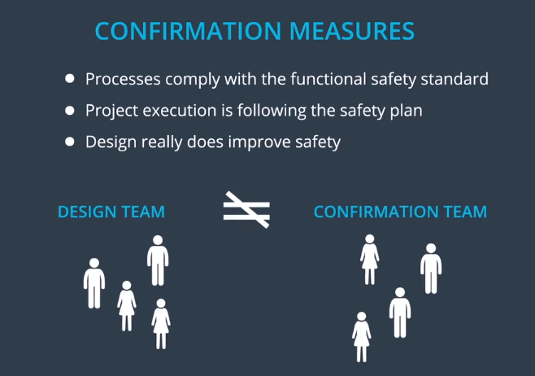

除了规定这些措施如何执行之外，安全计划也规定了每项措施的负责人。认可措施帮助确保产品的设计者和审阅专家之间相互独立。

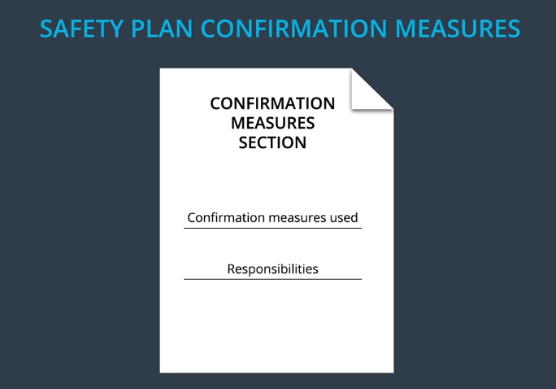

## Confirmation Measures Purpose 确认措施的目的
确认措施有两个目的:
- 功能安全项目符合ISO 26262
- 以及这个项目确实使汽车更安全。

执行确认措施的人员需要独立于实际开发项目的人员。

## Confirmation Measures Definitions 确认措施的定义
- **Confirmation review 确认审核**：确保项目符合ISO 26262。随着产品的设计和开发，一个独立的人将审查工作，以确保遵循ISO 26262。
- **Functional safety audit 功能安全审计**：检查以确保项目的实际执行符合安全计划被称为功能安全审计。
- **Functional safety assessment 功能安全评估**：确认计划、设计和开发的产品实际上实现了功能安全，称为功能安全评估。

您不需要在最终项目的安全计划中填写完整的确认措施部分;但你需要表明你理解确认措施的
目的。

## Levels of Independence
制定文件、计划、设计或者产品的人员，不得与实施确认措施的人员相同;确认措施需要独立性。ISO 26262要求不同级别的独立性，这取决于正在审查的功能安全生命周期的哪个部分。

例如，制定危害分析和风险评估(HARA)的部门或公司需要完全独立于确保HARA按照ISO 26262进行的部门或公司。这是因为HARA是识别高风险情况的关键第一步。

另一方面，开发低风险系统的人员可以与检查系统是否符合ISO 26262的人员在同一个团队中。

# 7. Summary
## Video
现在我们已经学习完了安全计划的主要部分,安全计划是设计一款安全产品中的第一步。在功能安全标准的指导之下设计一个系统需要有条不紊的设计和脚踏实地的执行。安全计划充当了一个向导 来指导怎样做可以实现功能安全，其还为项目的参与者分配了不同的责任，这确保了每个人都了解到自己该做什么工作并且确保有人在监控项目中的每一项任务。当项目通过设计，应用以及生产阶段后，最终产出的产品将会按照安全计划进行检测。现在，既然你已经学习了安全计划的主要部分，我们将开始学习V模型的概念，我们将从如何进行危害分析和风险评估入手进行学习。

## Safety Plan - Functional Safety Project 安全计划-功能安全项目
安全计划为功能性安全项目提供了一个总体框架。在课程结束时的项目中，您的任务之一将是记录模拟安全计划的一部分。我们将在整个功能安全课程中介绍一个先进的驾驶员辅助系统，您将使用您所学到的有关该系统的知识来制作您的文档。

让我们来复习一下你需要完成的部分:
- Purpose of the Safety Plan 安全计划的目的: 用你自己的话，你将描述安全计划的目的。
- Item Definition 项目的定义: 项目定义描述了考虑哪个系统进行功能安全分析。我们将在“功能安全概念”一课中更多地讨论项目定义。
- Goals and Measures 目标和措施: 你将被期望描述项目的目标。考虑功能性安全的目标是什么，以及该目标与项目的关系。
- Safety Culture 安全文化: 假设你在一家研究高级驾驶员辅助系统功能安全性的公司工作。你将描述公司安全文化的特点。
- Safety Lifecycle Tailoring 安全生命周期调整: 您将讨论功能安全标准的哪些部分适用于本项目。
- Development Interface Agreement 开发接口协议: 虽然您不需要创建开发接口协议，但是您将被要求描述协议的目的。你还需要区分你的公司负责什么和其他公司负责先进的驾驶辅助系统。
- Confirmation Measures 确认措施: 您将被要求描述确认措施的目的。您还将被要求定义确认审查、功能安全审计和功能安全评估等术语。

请看这个[链接](https://github.com/udacity/CarND-Functional-Safety-Project/tree/master/Template_Files)，安全计划模板文件，以查看我们为项目提供的安全计划模板。