# 1. Introducton
## Video
技术安全概念和功能安全概念看起来非常相似，我们会再次定义新需求，并把这些需求考虑进我们的系统架构中。不同之处在于功能安全概念从总体上考虑问题，而技术安全概念则更加具体一些，它从传感器，控制单元，制动器的级别来考虑安全需求。在本课中，我们重点讲述如何设计和开发技术安全概念，我们将回顾之前的功能安全概念并把它们转化为技术安全概念。
## Concept Phase Versus Product Development Phase 概念阶段与产品开发阶段
ISO 26262将功能安全概念置于概念阶段，而技术安全概念则是产品开发阶段的一部分。这是因为技术安全概念更加具体，涉及到项目技术的细节。产品开发阶段还包括硬件和软件的设计。本节课将只关注技术安全概念，下节课将讨论硬件和软件开发。

提醒一下，这是垂直拉伸的V模型的一个版本。您可以看到功能安全概念是概念阶段的最后一步。技术安全概念将属于系统一级的产品开发:

## Product Development Phase 产品开发阶段
产品开发阶段分为两部分:
- 系统级的产品开发
- 在硬件和软件层面进行产品开发

ISO 26262将一个项目视为一个系统中的系统。以车道辅助项为例。本项目有三个系统:
- 视觉系统(相机)
- 显示系统(汽车仪表盘)
- 运动系统(电子动力转向)

在开发硬件或软件之前，需要确定每个系统的技术安全要求。在确定各系统的技术安全要求之前，需要确定车道保持项的功能安全要求。

因此，技术安全概念包括:
- 将功能安全要求转化为技术安全要求
- 为系统架构分配技术安全需求

这将为我们在下一课深入研究软件和硬件实现打下基础。

## Technical Safety Concept at the System Level versus Technical Safety Concept at the ECU Level 系统级的技术安全概念与ECU级的技术安全概念

在ADAS车道辅助的例子中，我们已经说过，唯一与安全相关的子系统是电子动力转向。我们的例子将大部分与安全相关的功能放在了动力转向ECU中。这是一个简化的例子。大多数情况下，技术安全分析将涉及多个子系统。当存在多个子系统时，技术安全概念可能必须划分为多个文档。其中一个技术安全概念将被称为“系统级技术安全概念”。本文档将研究子系统之间如何交互。

可能会有一个单独的技术安全概念，深入到ECU级别。每个安全相关的ECU都有自己的技术安全概念文件。在我们简化的车道辅助示例中，唯一与安全相关的元素是电子动力转向ECU;因此，我们的技术安全理念将直接进入ECU层面。但总的来说，你需要发展多种技术安全概念;一个在系统级，然后一个为每个安全相关的ECU。以下图表显示如何将技术安全概念划分为若干个文件:

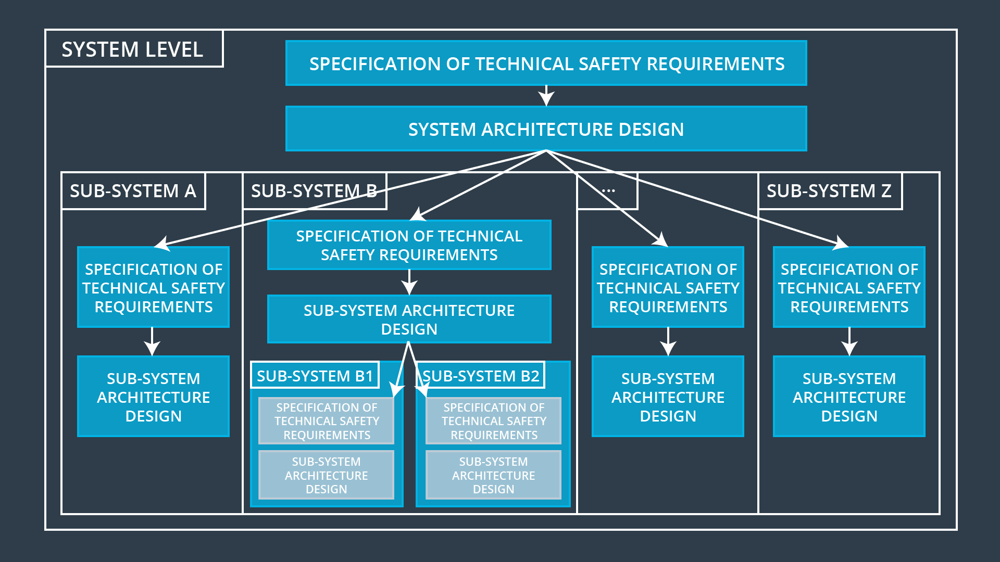

# 2. Deriving Technical Safety Requirements 制定技术安全要求
技术安全要求描述了当故障影响安全目标时，系统应如何响应。从车道偏离报警这个安全目标，我们可以引出一个例子。回想一下，从上述安全目标我们曾经推导出一个功能安全要求，那就是电子助力转向ECU需要将转矩幅度控制在某个最大值之下。现在，我们会更进一步推导出一个技术安全要求。

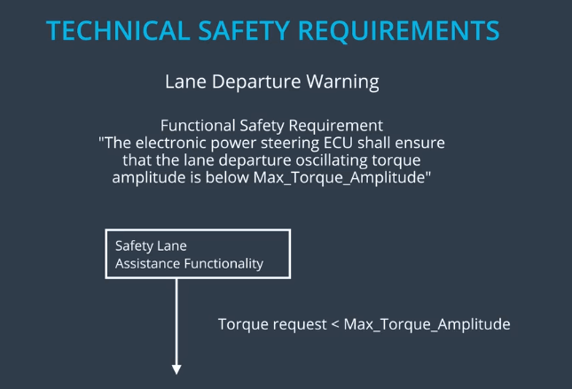

当车道偏离报警软件发送一个转矩请求时，请求的幅度值应该小于一个最大的允许值。从系统架构图上来看，以上要求的更具体定义是LDW 安全组件应确保其发送给最终电子助力转向扭矩组件的扭矩请求幅度值小于最大扭矩幅度值。后面，我们使用缩写来让需求描述变得更清晰简洁，LDW 表示车道偏离报警，EPS 代表电子助力转向。

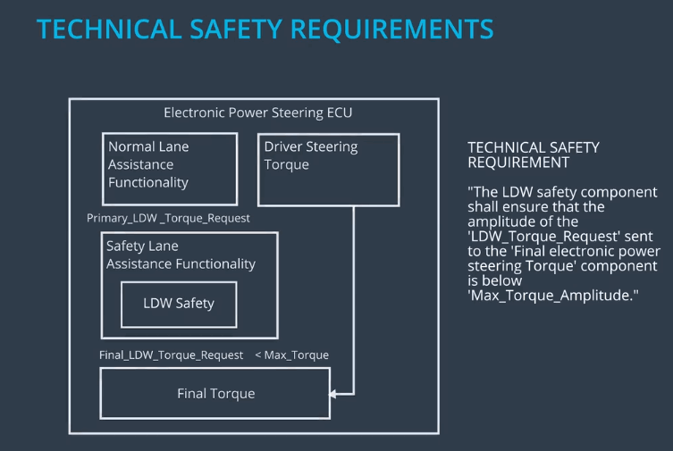

现在注意一下，功能安全要求和技术安全要求的不同之处，技术安全要求给出了某个系统将会做什么的一般概念。而技术安全要求则指出了具体信号流并具体描述了某个功能将由哪个组件负责完成

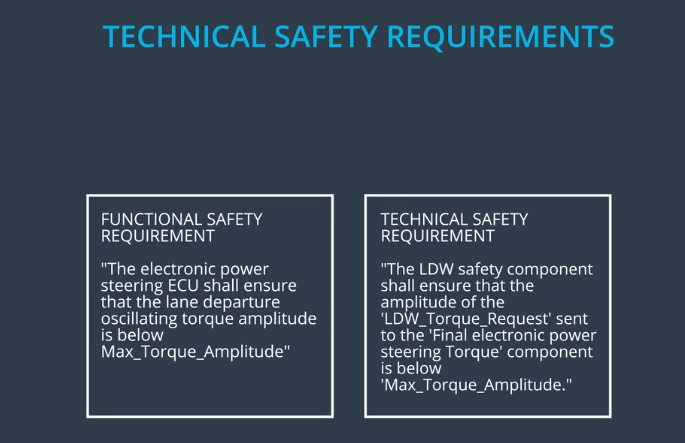

# 3. Other Types of Technical Safety Requirements
## Video
并非所有技术安全要求都可以从软件安全要求直接导出。实际上根据ISO 26262的要求还有5类其他的技术安全要求，其中的两个类别，
- 一是系统失效检测，
- 二是与系统交互的外部设备失效检测；

另外三类包括，
- 能够让系统达到安全状态的措施
- 实现一个报警和降格的概念
- 预防潜在的失效

这里是一个车道偏离报警功能的例子，可以用来说明上述各类情况。系统内故障可能包括软件错误以及硬件组件失灵。

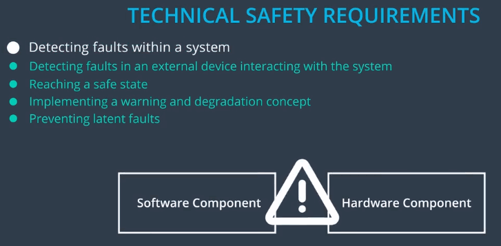

一个通用的**技术安全要求**是，应确保数据传输的正确性和完整性。在这里，数据指的是与车道偏离警告相关的扭矩请求信号。在视频下方的文本中，我们会讲述**检测**数据有效性和完整性的详细方法。

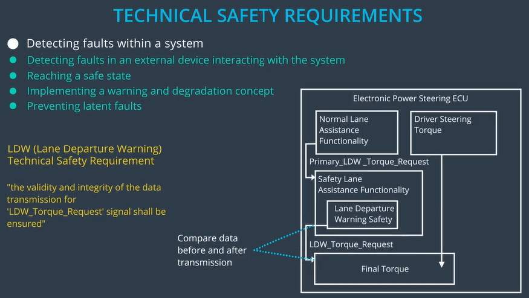

现在我们来看一个故障，这个**故障**对于车道辅助模块而言是**外部的**。我们假设一个外部的防抱死制动ECU正在向车道保持辅助设备**传输速度信息**，在制动ECU和转向助力ECU之间的一个传输错误可能导致一个故障发生。

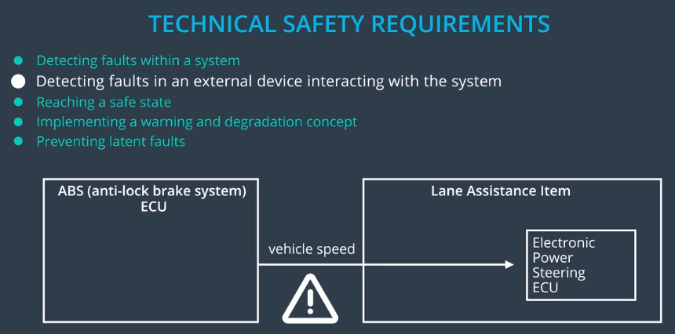

需要添加一些代码来检测ECU之间的通讯故障，并获取相关信息。这样我们就可以推出一个**技术安全要求**。该要求让系统更可以**达到**并维持安全状态。

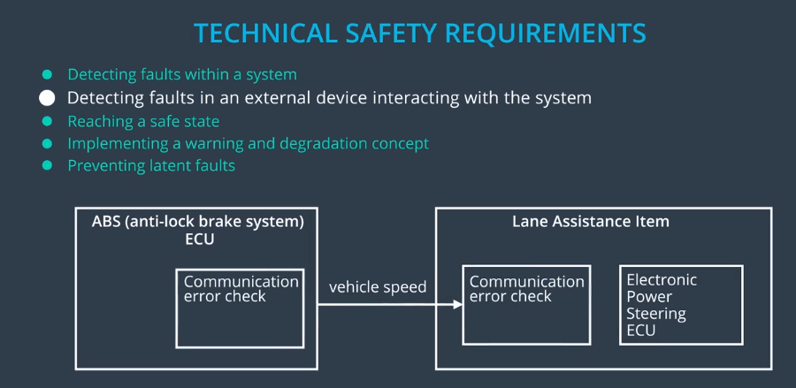

在功能安全概念中，我们已经得出安全状态，那就是车道辅助系统应该被关闭。对应的**技术安全要求**则是一旦LDW功能检测到一个故障，应该马上使 LDW 的功能失效并把LDW模块的扭矩请求值置为0。

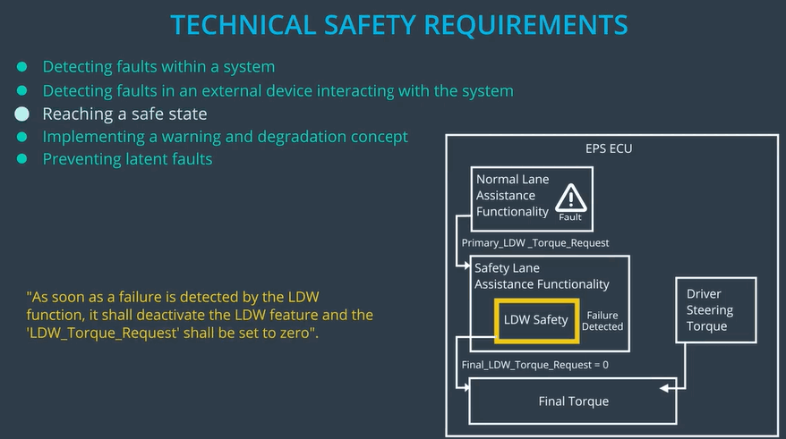

技术安全要求的下一个类别是实现报警和降格概念。在上一课中我们讲过如果车道辅助模块失灵，报警灯会亮起来。对应的**技术安全要求**则是一旦LDW功能使LDW模块失效时，LDW安全软件模块应马上发信号到车辆的显示系统ECU，该信号会打开报警灯。

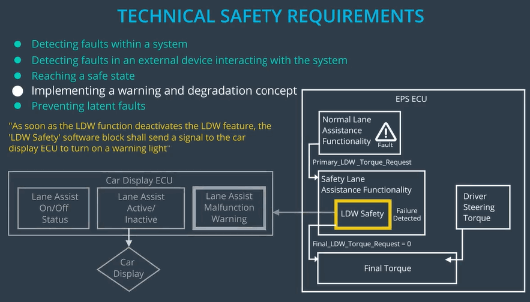

最后，我们来讨论一个与预防潜在失效措施相关的例子，潜在错误是指已存在但是未能检测到的错误。一个例子是用来检测故障的软件代码中的错误，预防潜在故障的措施通常发生在加电、断电、或者维护过程中。对于车道保持辅助模块来说，对应的**技术安全要求**是在EPS ECU启动时进行内存检测。检测内存是否有故障，功能安全标准只要求避免 ASIL C或D级别模块的潜在故障。

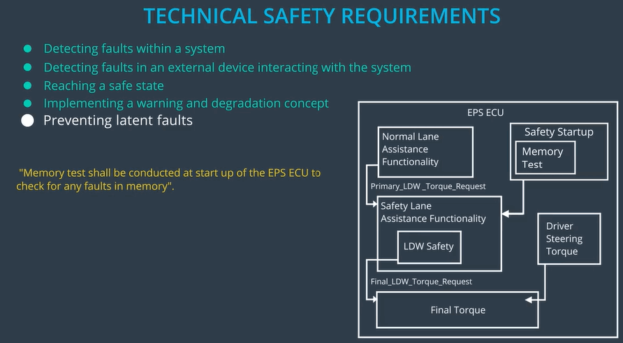

现在，我们已经讨论了不同类型的技术安全要求，接下来我们会讨论与这些要求相关的一些其他属性。包括ASIL容错时间间隔以及对于安全状态转换的描述。

## ISO 26262 Definition of Latent Faults 潜在故障的定义
ISO 26262对潜在故障更严格的定义如下:
 > 多点故障(3.96)，在多点故障检测时间间隔(3.97)内，安全机构(3.141)没有检测到多点故障(3.141)，驾驶员也没有感知到多点故障(3.96)的存在。

## Faults External to the Lane Keeping Item 车道保持项外部故障
我们提到，对于外部故障，一个可能的技术安全要求是检查防抱死制动ECU和动力转向ECU之间通信错误的代码。防抱死制动ECU可以与动力转向ECU共享车速数据。在本课的其余部分，我们不打算详细讨论这个例子。但是如果你想挑战自己，可以考虑在期末项目中扩展这个想法。

假设车道保持辅助功能在决定施加多大扭矩时没有考虑驾驶员的速度。这可能会导致一种潜在的危险情况，即系统在高速行驶时过于突然地转动方向盘。或者车道保持辅助在急转弯时提供了过多的额外扭矩。司机可能会失去对汽车的控制。所以这个想法可能是危险和风险分析的一部分，这将导致一个安全目标。然后从安全目标中得出功能性安全需求。最后从功能性安全需求中得出技术安全需求。

## More Technical Safety Requirements 更多技术安全要求

很快就轮到你来确定技术安全要求了!在项目中，您将负责为其他两个功能安全需求导出技术安全需求。

另外两个功能安全要求是:
- “电子动力转向ECU应确保车道偏离警告振荡扭矩频率低于Max_Torque_Frequency”。
- “车道保持辅助功能应有时间限制，额外的转向力矩应在给定的定时器间隔后结束，使驾驶员不能滥用系统进行自动驾驶。”

您将使用我们已经给出的示例作为推导技术安全需求的指南。事实上，大多数已经导出的技术安全要求也将与其他两个功能安全要求相关。您可能必须更改变量名或体系结构元素名。

请记住，某些技术安全要求可以直接从功能安全要求派生出来;其他技术安全要求将属于上述视频中描述的五类。

## Methods for Checking Data Validity and Integrity 检查数据有效性和完整性的方法
其中一项技术安全要求提到检查数据传输的有效性和完整性:“应确保LDW_Torque_Request信号数据传输的有效性和完整性。”要检查数据的有效性和完整性，可以添加CRC(循环冗余检查);CRC是一种成熟的方法，用于查找对原始数据的更改。然后还可以添加一个限定符，它是一个信号，指示一个信号是否有效。CRC确保一个元素发送的数据与另一个元素接收的数据相同。另一种常见的机制是活计数器。活计数器检查信号是否为新信号而不是旧信号;一个活计数器在每次信号发出时增加计数。CRCs和活计数器可以一起使用，以确保正确的传输。软件需求的最后一课还将更深入地讨论特定的CRC协议。

# 4. Technical Safety Requirement Attributes
技术安全要求与功能安全要求具有一些相同属性。前面我们已经讨论过功能安全要求的属性，这些属性包括ASIL，容错时间间隔以及安全状态转换的描述。技术安全要求从功能安全要求中继承了ASIL属性，因为车道偏离报警在功能安全要求中级别为ASIL C，在技术安全要求中它的级别依然为ASIL C

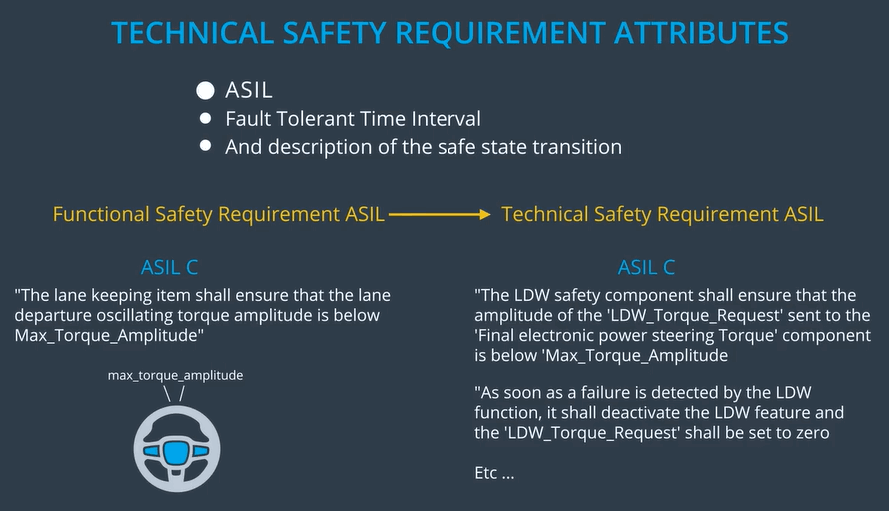

唯一例外的是最后一类要求，即内存检测，它的级别为ASIL A。 因为标准上说导致ASIL C 级别要求的潜在故障可标为ASIL A。

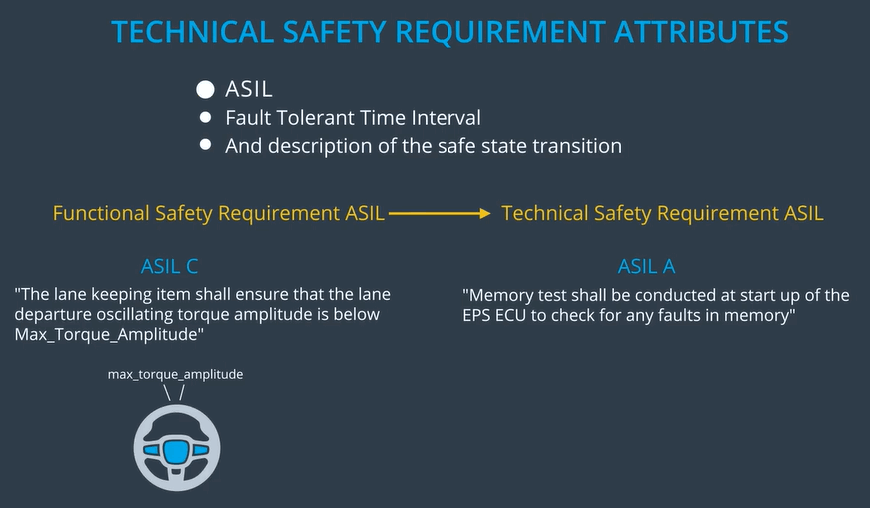

就像我们在功能安全概念中做的那样，我们还可以对ASIL进行分解。另外，对于每一个技术安全要求，容错时间间隔值可能需要调整。但是在这里我们维持它们的值不变。目前为止，在车道偏离报警功能相关的所有技术安全要求中时间间隔依然是50毫秒。

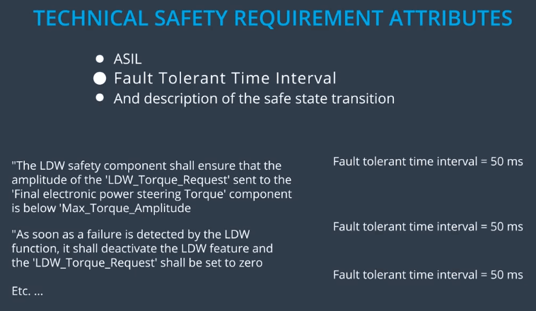

内存检测在技术安全要求中仍然是个例外，在内存检测中容错时间间隔包括了内存损坏的检测时间以及检测内存损坏导致的的系统中断时间，系统在启动时会做内存检测。我们可以把容错时间间隔看做是车辆点火循环的长度。

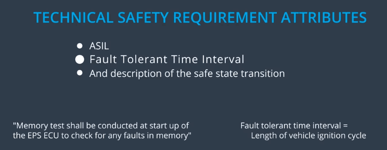

对所有这些故障，安全状态是指车道偏离报警的请求幅度值应设置为0。

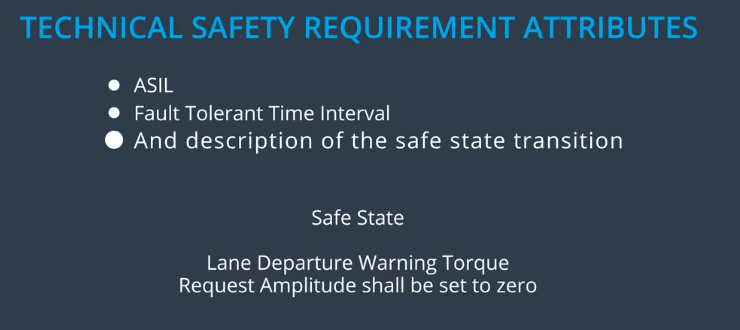

这里有一个表格，总结了我们前面所讨论的所有项目。现在，我们已经定义了技术安全要求，下一步要做的是把这些要求放到我们的系统架构中。

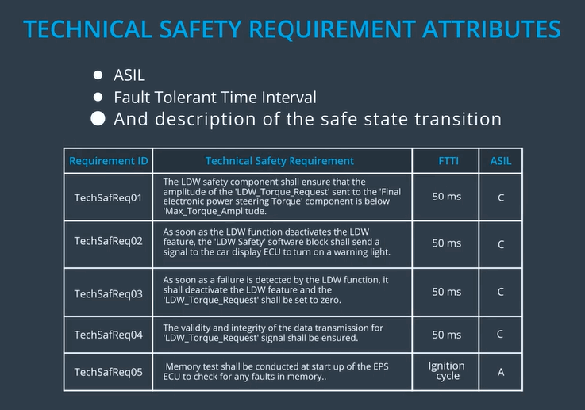

# 5. Allocation of Requirements to System Architecture Elements

## Technical Safety Requirements Review 技术安全要求回顾

以下是我们目前确定的技术安全要求清单。
- LDW安全组件应确保发送到“最终电子动力转向扭矩”组件的“LDW_Torque_Request”的振幅低于“Max_Torque_Amplitude”。
- 一旦LDW函数检测到故障，它将禁用LDW特性，并将'LDW_Torque_Request'设置为零。
- 一旦LDW功能关闭LDW功能，“LDW安全”软件块将向汽车显示ECU发送信号，打开警告灯。
- 确保“LDW_Torque_Request”信号数据传输的有效性和完整性。
- EPS ECU启动时应进行内存测试，检查内存是否有故障。

## Video
就像前面功能安全概念中我们所做的，现在我们把技术安全要求纳入我们的系统架构中。我们会把前三个技术安全要求放在我们的LDW软件安全组件中。我们来总结一下这三个安全要求完成的工作，LDW安全软件元素从基础车道保持功能块中获取震动扭矩请求。

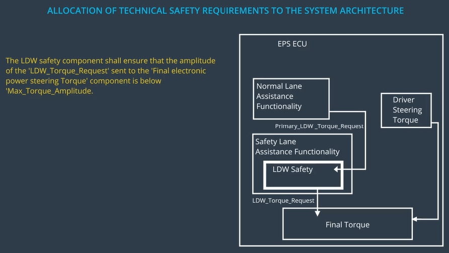

然后LDW安全软件元素检查请求，确保其值小于最大幅度和频率值。

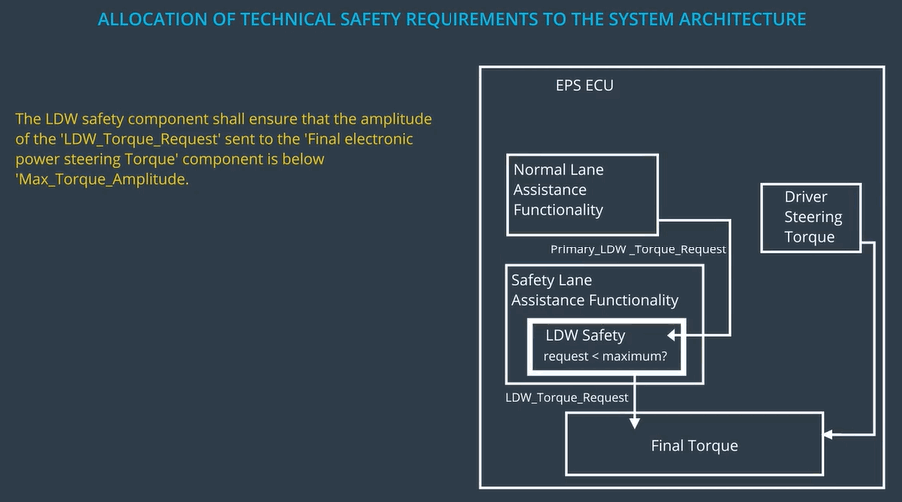

如果请求值大于限定值，LDW安全软件元素会忽略该请求并将扭矩请求值设为0。

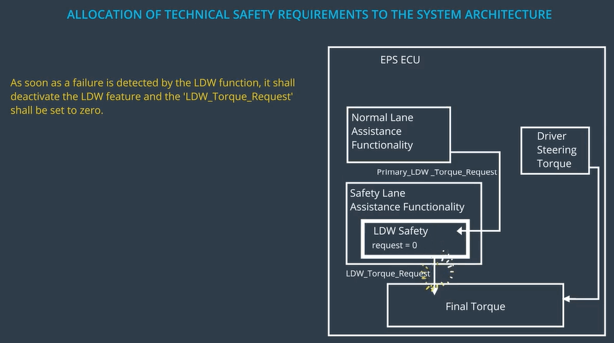

然后 LDW 安全块把存储的请求数据发送给最终的 EPS 扭矩生成块。报警灯会闪烁提示司机有故障，然后，LDW安全模块会发送状态信号到车辆的显示模块，信号用来提示是否车道辅助系统处于活动状态且工作正常。状态信号也会进入最终EPS扭矩生成模块，该模块使用状态信号做附加检测，以决定是否发送无效信号到引擎。

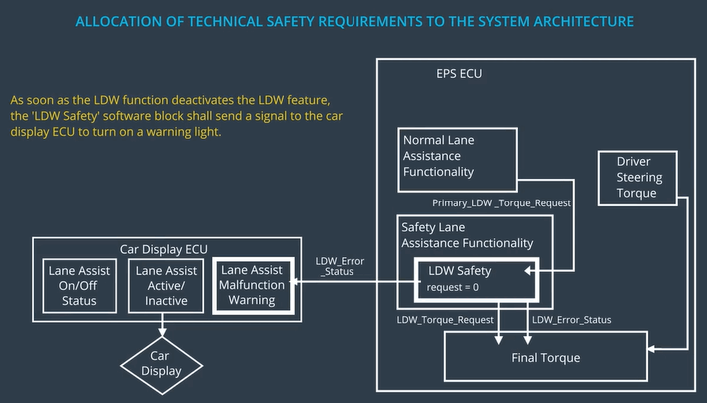

为了检测扭矩请求的正确性和完整性，在LDW安全块和最终EPS扭矩生成块之间，我们会专门放一个软件模块，该模块确保信号在传输过程中没有损坏。

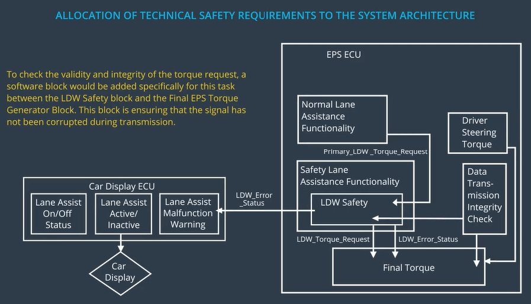

对于内存检测要求，我们用一个分离的外部代码块来实现，因为车辆上的各个ECU并不能集成这个代码块，所以在车辆启动时我们会运行它。

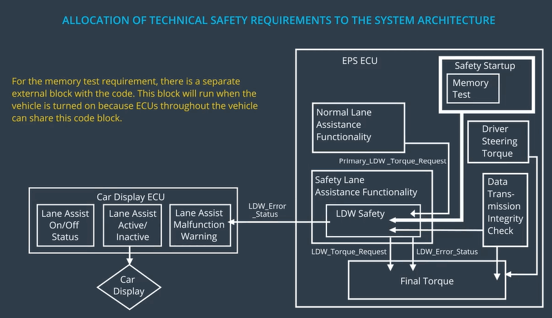

各功能模块的ASIL，从技术安全要求中得出。大家可以看到这些安全相关模块被标为ASIL C，除了内存检测代码块，我们前面讲了内存检测模块需要被标为ASIL A，基础车道辅助功能被标为QM。这个我们在上一课中讲ASIL分解时提到过，现在我们已经得出各个技术安全要求并已经把它们放在我们的架构中。

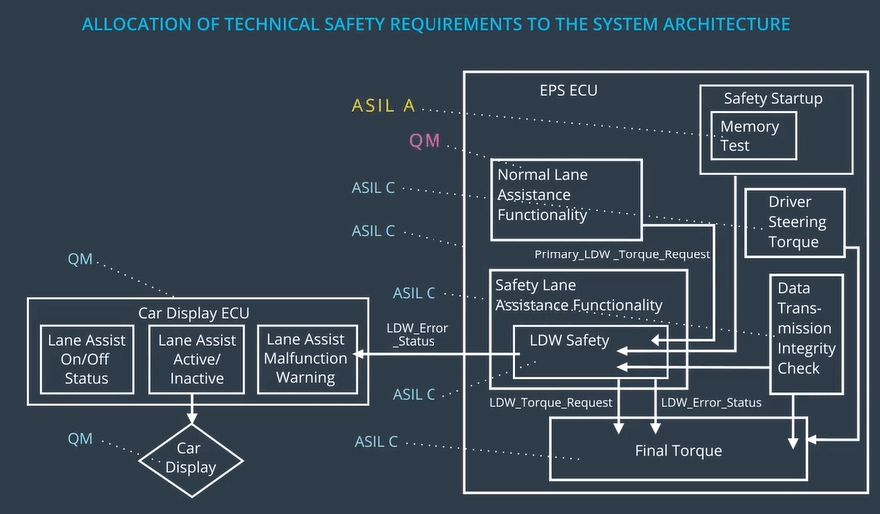

## Other Things to Consider

在以技术安全概念提炼系统架构时，需要考虑以下几个限制:
- Elements从技术安全要求中继承了最高的ASIL。因此，如果相同的软件Elements为车道偏离警告和车道保持辅助功能提供功能，则ASIL最高的会胜出。在这个例子中，车道偏离警告有ASIL C，而车道保持辅助有ASIL B，所以ASIL C赢了。
- 如果一个元素包含具有不同ASILs的子元素，那么两个子元素都接收到最高的ASIL。如果一个子元素有一个ASIL，但是另一个子元素是QM，那么应用相同的规则，两者都将获得最高的ASIL。如果满足共存的条件，则例外。共存的标准在前一课中已经讨论过了。如果一个子元素中的失效不会影响另一个子元素，那么子元素可以有不同的ASILs。
- 安全相关元素的内部和外部接口需要明确定义。这样，与安全无关的元素也可以清楚地标识出来。

## System Diagram 系统图
这是一个系统图，添加了技术安全要求的功能:

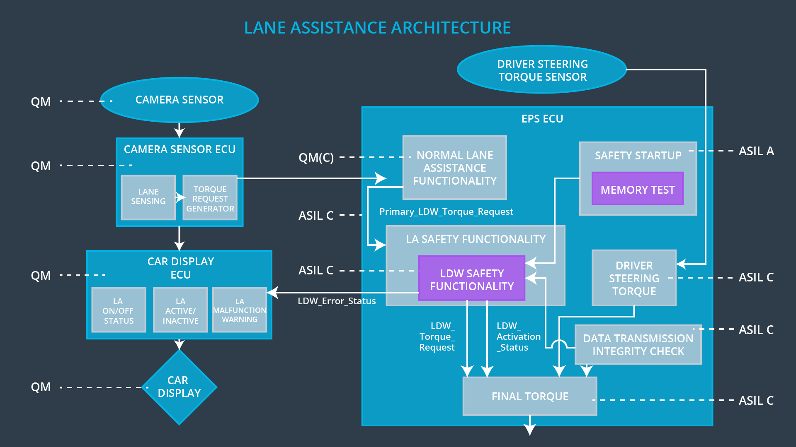

## Allocation: Functional Safety Concept versus Technical Safety Concept 分配:功能安全观与技术安全观
在功能安全概念中，您将所有需求分配给EPS ECU。现在，您的系统图有了更多的细节。因此，仅仅将技术安全要求分配给EPS ECU是不够的;技术安全要求将分配给不同的软件元件，例如“LDW安全功能”块、“数据传输完整性检查”块或EPS ECU内的其他相关块。

## Allocation for the Other Technical Safety Requirements 其他技术安全要求的分配

根据我们提供的关于车道偏离警告技术安全需求的信息，您可以为车道保持辅助功能派生出一些技术安全需求，然后将这些需求分配给体系结构。这将是项目的一部分。

# 7. Summary
现在我们已经正确定义了技术安全要求，并把这些要求纳入了我们的系统架构。自上而下浏览技术安全概念的V型模型，这里是软硬件开发部分，开发软硬件和我们以前做的工作类似。首先，将安全要求具体化，接着设计软硬件架构。下一节课中，我们会根据功能安全标准来介绍软件和硬件开发。

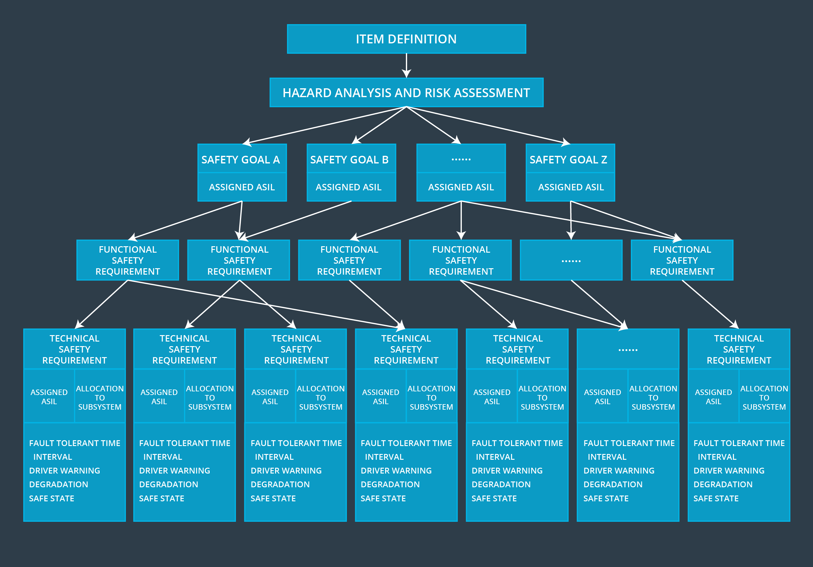