# 2. V model
## Hardware and Software Product Development Life-Cycle

让我们概述一下硬件和软件产品开发周期。V模型将硬件和软件划分为各自的微型vs:

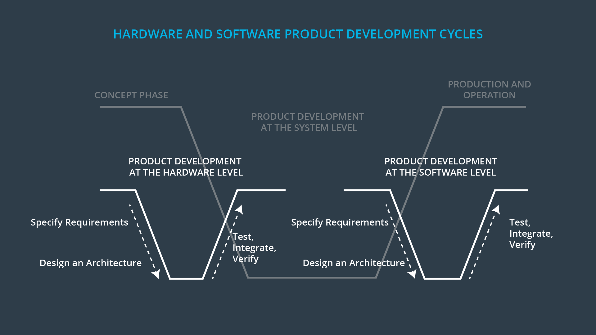

每个V表示的一般思想保持不变;首先，指定安全要求。然后将这些需求分配给系统架构。最后进行测试、集成和验证。每个V模型过程都是我们在第一节课中讨论过的相同的过程。

但在硬件和软件方面还有一个额外的步骤。对于硬件，V模型包括关于**硬件体系结构度量和随机硬件故障评估**的部分。下面是硬件V模型的更详细视图:

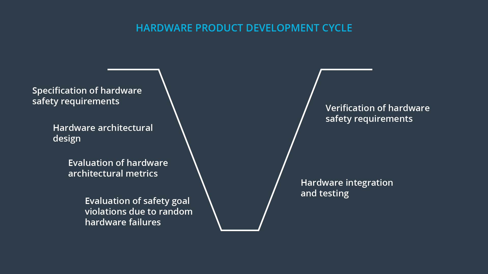

在软件方面，有一个架构设计部分和一个单元设计部分:

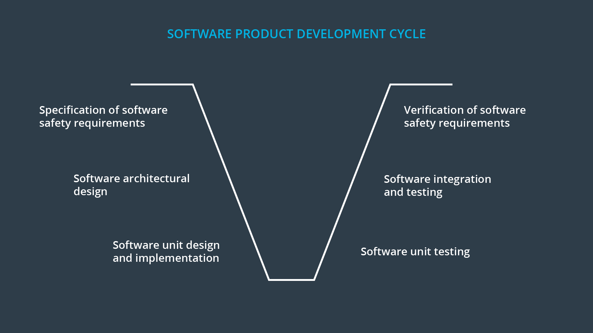

在本节课中，我们将讨论**随机硬件故障**以及如何开发软件安全需求。

## Architectural Design vs Unit Design
软件体系结构设计是软件组件的高级视图。例如，这可以是我们lane assistance例子中的camera ECU。

单元是软件体系结构中较小的一部分。一个单元可以是一个软件驱动程序，从相机传感器读取原始数据。对于什么属于体系结构设计部分，什么属于单元设计部分，没有硬性的规则。一般来说，功能安全性可以是一个迭代过程，其中开发V模型的新部分可以导致前面部分的更改，反之亦然。

在下面的图中，您可以看到功能性安全项目中涉及的内容的大致轮廓。你可以看到V模型的步骤被垂直拉伸。通常一个项目会有多个系统和子系统。子系统将有自己的软件和硬件需求。这些子系统需要集成到更大的系统中:

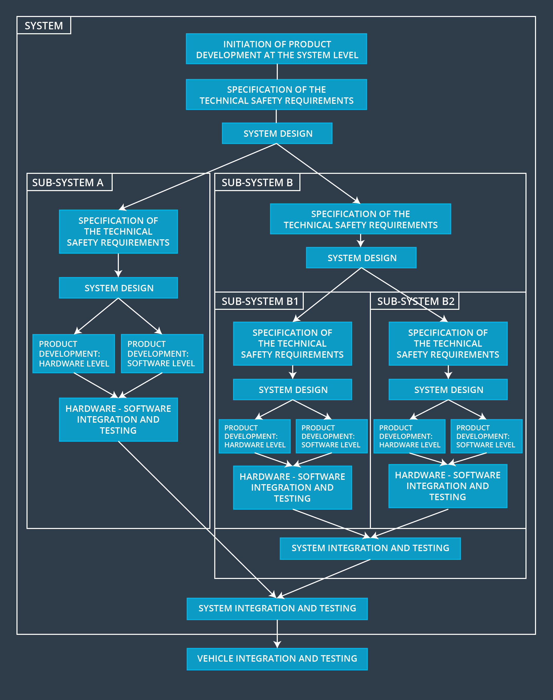

请注意，由于需要开发定制的软件和硬件，此处描述的“上下文”开发可能变得不切实际。为了缓解这种情况，一种常用的方法是“上下文外的安全元素”(SEooC)，**它考虑使用标准的安全硬件和软件组件来实现功能安全**。您可能喜欢这篇描述SEooC实用方法的有趣文章。

# 3. Hardware Failure Metrics
随机硬件故障肯定会发生，没有办法绕过它。例如，由于热膨胀硅可能会磨损或连接会断裂，宇宙辐射和磁场也会导致硬件失效。给定的时间段内允许的故障次数，将取决于 ASIL。例如 ASIL D系统每1亿个小时出现的故障次数不到一次。

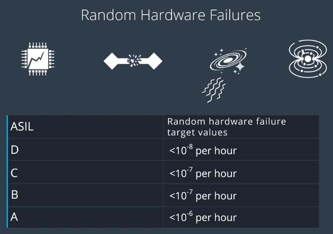

除了这些硬件故障目标值之外，功能安全标准还定义了一些称为**架构安全度量标准的随机硬件度量**。这些指标包括单点故障指标，潜在故障指标和随机硬件故障的概率度量，每个ASIL对于这三个度量具有不同的允许阈值，我们不会详细说明如何计算，不过 你可以在功能安全标准的第五部分找到更多信息。

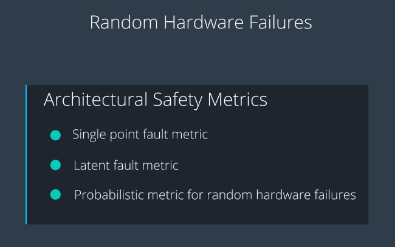

请注意，architectural metrics具有独立于实现的值，并表示为速率。硬件故障概率度量(Probabilistic Metric for Hardware Failures [PMHF])的绝对单位表示为每10^9小时的故障。因此，PMHF本身并不是一个architectural metric，而是与hardware failure metrics的讨论相关。

硅磨损是`Systematic failure`而不是`Random hardware failure`，这也是有争议的，所以它可能不被认为是`Random hardware failure`的一部分。

## 有关硬件故障度量的更多细节
本质上，这些度量着眼于**安全机制覆盖的硬件故障的百分比**。**安全机制**是在**发生故障或检测到故障已经发生时**保持车辆安全的一些功能。这意味着在一个安全的系统中，大多数硬件故障都会被检测到。

这里有一个例子。如果RAM因为UV辐射引起位翻转而失败，则需要一个安全机制来修复位翻转，使系统处于安全状态，并/或警告驱动程序发生故障。

标准认为硬件故障是不可避免的。但如果它们真的发生了，那么理想情况下它们不应该导致安全问题。ASIL D的单点故障度量大于99%，而ASIL B仅大于90%。换句话说，对于ASIL D, 99%的单点故障都应该被检测到，或者对于特定的安全目标来说是安全的。

要计算这些指标，您必须确定哪些硬件故障会导致危险情况，哪些故障不会。该标准实际上将硬件故障分为六类。

## 故障分类
要计算硬件故障指标，需要将故障分为以下六类之一。我们将在这里列出它们作为参考，尽管我们在本节课中不会实际计算硬件故障度量。
- 单点故障（Single point fault）: **元件中没有安全机制**来检测故障的故障。该故障还会导致违反安全目标。例如，没有安全机制来纠正错误的RAM故障将违反安全目标。
- 剩余故障（Residual fault）: **元件具有安全机制**，可检测**某些类型**的故障;但是，如果发生了，**没有设计机制用于检测的故障，并且该故障还会导致违反安全目标**。例如，RAM可能有一个ECC(纠错代码)机制来修复位翻转;然而，由于短路而发生了另一种故障，RAM对短路没有安全机制。
- 潜在的多点故障(Latent multiple point fault): 安全机构和驾驶员**无法检测到的**多点故障。
- 感知多点故障(Perceived multiple point fault): 司机**检测到的**多点故障，因为该故障导致**限制了车辆功能**。例如，司机注意到刹车反应减弱，或者在没有反应的情况下启动车头灯(他们没有打开)。
- 检测到的多点故障(Detected multiple point fault): 安全机构检测到的多点故障，并将车辆**带到安全状态**。
- 安全故障（Safe faults）: 不会导致违反安全目标的故障

**多点故障**的一个例子：RAM和ECC(纠错代码)机制。
- ECC纠正位翻转。如果RAM由于位翻转而包含错误，ECC将纠正该翻转。如果ECC因为软件错误而失败，RAM仍然可以正常工作。如果有位翻转并且ECC失败，则会出现多点故障，因为位翻转不会得到纠正。RAM和ECC都将失败。
- 循环冗余检查(CRC)将检测ECC机制中的故障。如果没有CRC，故障将无法检测到，因此是**潜在的**（Latent multiple point fault）。使用CRC，故障将成为**检测到的多点故障**（detected multiple point fault）。如果司机被用类似于警告灯的方式告知故障，那么这是一个**感知到的多点故障**（perceived multiple-point fault）。

## 测量故障 （Measuring Faults）
如何实际测量故障和故障率? 你可以：
- 现场测试测量在给定时间内的故障数量
- 使用来自等效或类似系统的现有数据
- 供应商还应该提供计算这些度量的数据

请注意，ISO 26262**没有为随机硬件故障指定目标**。有一个Probabilistic Metric for Hardware Failures (PMHF)，它关注每个安全目标中危险的、未检测到的硬件故障。ISO 26262建议只有在没有数据支持目标时才使用PMHF值。这是一篇关于PMHF和随机硬件故障的有趣的[论文](http://publications.lib.chalmers.se/records/fulltext/218280/218280.pdf)。

## 失效的来源和类型(Sources and Types of Failures)
电阻并不是唯一可能失效的硬件组件。还需要考虑整个处理单元。硬件寄存器、内部RAM、控制器逻辑以及其他组件都可能发生失效。**所有这些失效都需要由安全需求覆盖，然后分配到体系结构中，并记录在安全概念中**。安全概念将讨论如何检测或避免这些失效。

# 4. Programming Languages

软件开发的首要考虑之一是选择一种编程语言或建模框架。某些语言更适用于功能安全，C/C++和 MATLAB/SIMULINK都是不错的语言选择,所有这些语言共享某些特性,使其适用于功能和安全应用.
- 首先，它们都有明确的语法和语义定义
- 其次，它们都在实时操作系统上运行
- 第三，它们都支持运行时错误
- 最后，他们支持模块化

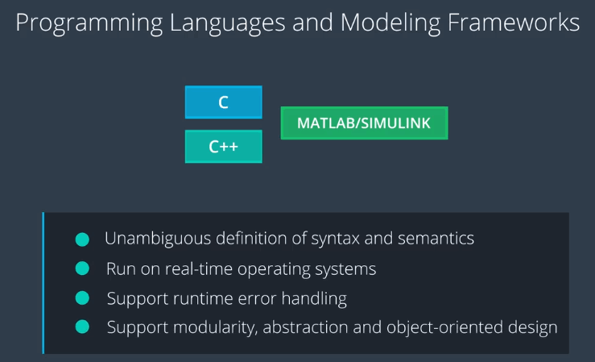

抽象和面向对象的设计功能安全还需要使用软件开发指南，最常见的两个准则是 MISRA C和MISRA C++，MISRA 代表汽车行业软件可靠性协会，这些准则定义了：
- 适用于安全关键应用程序
- C 和 C++ 编程语言子集
- 他们讨论防御性实现技术
- 语言子集，风格指南和命名约定

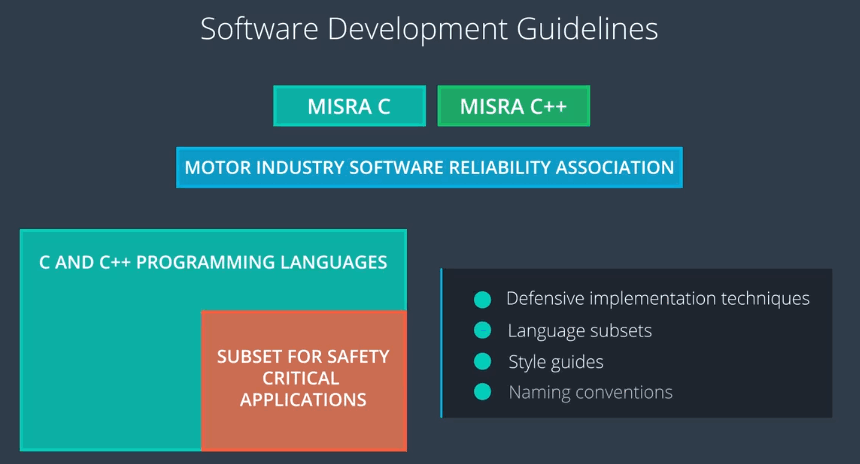

## 编程语言说明
任何编程语言都有优缺点。c++的一个优点是能够编写具有许多输入输出操作的高速软件。另一方面，c++将允许您在布尔变量中存储浮点数。而且c++在运行时错误检查方面提供的功能并不多。

MISRA c++标准讨论了适合于安全关键应用程序的c++子集。该标准包含一组关于如何在汽车应用程序中使用c++语言的规则。

## 软件工具&软件工具置信度
汽车软件工程师使用各种工具来帮助开发软件。编译器是软件工具的一个例子。其他示例包括版本控制软件、测试工具、自动生成代码的图形化建模工具，以及帮助确保MISRA遵从性的工具。

功能性安全标准要求您对软件工具进行资格认证，以确保它们适用于安全关键应用程序;使用自动化代码生成和代码测试的软件工具变得越来越普遍。例如，如果测试工具有问题，那么代码错误可能无法检测到。

ISO 26262描述了一个度量工具置信度的度量标准。这个度量称为工具置信度（tool confidence level）或TCL。

评估置信度水平需要考虑两件事:
- Tool Impact (TI)：工具本身是否会发生故障并违反安全目标
- Tool Error Detection Capability (TD)：如果工具发生故障，就是可检测到的或停止的故障

然后，您可以使用TI和TD度量来计算工具的置信级别。ASIL较高的软件块需要TCL1，这是最高的置信度。TCL3是最低的置信度。

需要对TCL2和tcl3评级较低的置信度工具进行合格性检查。合格性包括通过严格的测试运行该工具，以证明它不会导致任何错误。软件工具供应商提供资格认证工具包，帮助您在自己的环境中测试他们的工具。

# 5. MISRA C++ Lab

## MISRA Lab
### The MISRA C++ Standard
MISRA c++标准定义了c++的一个子集，适用于安全关键的自动化应用程序。该标准包括数百条关于在开发汽车软件时如何使用c++语言的规则。通常，软件工程师使用代码要求检查包来确保他们的代码符合标准。在这个实验室中，您将收到工作的c++ Kalman过滤器代码，其中包含大量违反MISRA的代码。您的工作将是修复错误，并使代码尽可能接近要求。

MathWorks正在为您提供一个MISRA遵从性检查软件的试用版，该软件名为Polyspace。Polyspace是工业中用于编写符合MISRA的c++代码的最常见的软件程序之一。这个程序是一个更大的数学和工程工具套件MATLAB的一部分。

个人注：因为MISRA C++标准是收费的，可以阅读[AutoSAR C++标准](https://www.autosar.org/fileadmin/user_upload/standards/adaptive/17-10/AUTOSAR_RS_CPP14Guidelines.pdf)

# 6. Software Safety Life-cycle
从功能安全的角度来看软件开发涉及四项主要任务:
- 首要任务是开发软件安全要求
- 第二项任务是指定一个软件架构
- 第三项任务是测试软件,以确保架构符合要求
- 最后 将软件与硬件集成起来
  
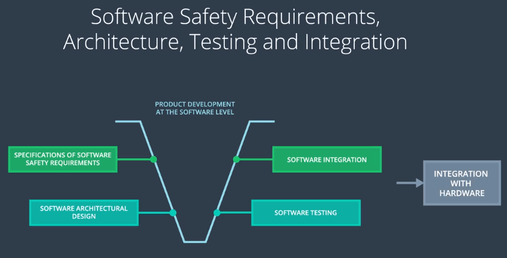

这四项任务可能看起来很熟悉，与我们以前讨论的所有级别V图具有相同的四个步骤。软件安全要求从哪里来？许多软件**安全要求直接来源于技术安全要求**。一般来说 这些要求涵盖了使系统能够保持或达到安全状态的功能。用于检测、指示和处理硬件和软件故障的功能。典型的软件安全要求可能基于时间限制，如容错时间间隔，警告灯功能通常也与软件安全要求相关联。CAN，以太网连接或用户界面等通信接口通常也可以通过软件安全要求来解决。

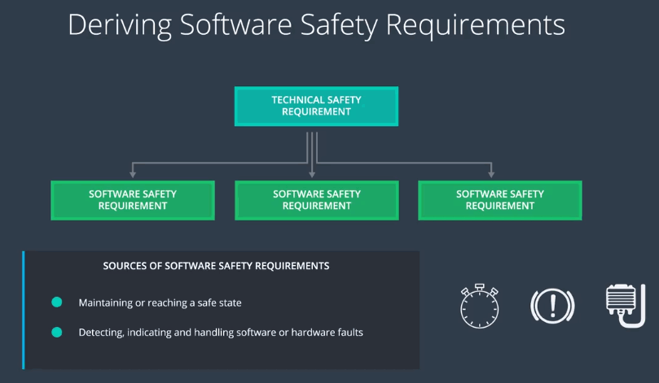

下面我们将从车道偏离警告技术安全要求中推导出一些软件安全要求，然后我们将这些要求分配给架构，请记住，没有独立的安全软件体系架构，安全软件要求会分配给整个产品架构设计。除了技术安全要求之外还有一些其他的软件安全要求来源我们将在下一部分讨论。

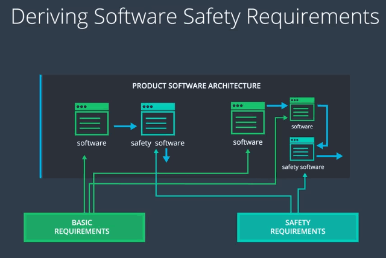

## Software V diagram
在视频中，我们简化了软件安全V模型，表明软件安全生命周期与功能安全分析的其他层次包含相同的四个步骤:
- 详细说明安全要求
- 设计体系结构并将需求分配给体系结构
- 软件测试
- 软件集成

下面是软件安全生命周期的一个稍微详细的版本:

开发软件体系结构应该同时考虑安全性和非安全性需求。软件安全需求和软件产品需求不能划分为两种不同的体系结构;软件架构将是产品需求和安全需求的混合体。

一个架构设计可能涉及多个微控制器或ECUs。因此，需要指定软件接口、数据路径、流程序列和定时行为。

## 软件单元
软件架构通常被进一步细化为更小的单元。因此，技术安全需求导致软件安全需求，而软件安全需求又进一步细化为软件安全单元需求。然后，单元需求导致了架构的进一步细化。

## 测试规范
在V模型的右侧，测试规范和测试用例来自于安全需求。记住V模型有层次结构。当您向上构建集成了具有更高系统级别的软件的V模型时，**每个阶段都需要自己的测试**。

# 7. Software Safety Requirements Lane Departure Warning

## Software Safety Requirements - Lane Departure Warning Amplitude Malfunction

对于本模块的目的，我们不期望您推导出软件安全需求。但是下面的示例应该让您了解如何从技术安全需求派生出软件安全需求。实例还说明了技术需求和软件需求之间的主要区别;
- 软件需求比技术需求更加具体。
- 软件需求指定变量名、信号路径、软件协议和机制。
- 软件工程师应该能够根据软件需求和软件体系结构编写程序。

我们将向您展示由技术安全需求派生而来的软件安全需求示例。首先，我们将向您展示精致的架构，然后解释我们添加的所有新元素:

### Software Safety Requirements Derived from Technical Safety Requirement 01
让我们挨个看一看我们的技术安全需求，然后得出软件安全需求。在我们解释新功能时，您可能想要返回到该图。这是我们的第一个技**术安全要求**:

 ID | Technical Safety Requirement | ASIL | Fault Tolerant Time Interval | Allocation to Architecture  
-----|-------|-------|------|----
TechnicalSafetyRequirement01 | LDW安全组件应确保发送到最终电子动力转向扭矩（Final EPS Torque）组件的LDW_Torque_Request的振幅低于Max_Torque_Amplitude | C | 50 ms | LDW Safety

我们将把LDW SAFETY组件分成三个块:
- 第一个块将从Basic/Main Lane Assistance功能组件获得扭矩请求。第一个块将执行所需的任何预处理。
- 然后该模块将结果发送到torque limiter block，该模块将检查扭矩是否超过允许的最大振幅。如果达到极限，扭矩要求被设置为零。
- 最后，我们将添加第三个块，使信号准备好传输到最后的torque generator。

以下是新的**软件安全需求**:

ID | Technical Safety Requirement | ASIL | Allocation Software Elements | Safe State
------- | ------- | ------- | ------- | -------
SoftwareSafetyRequirement01-01 | 读取输入信号`Primary_LDW_Torq_Req`并进行预处理，以确定来自`Basic/Main LAFunctionality`SW组件的转矩请求。信号`Processed_LDW_Torq_Req`应在处理结束时生成。 | C | LDW_SAFETY_INPUT_PROCESSING | N/A
SoftwareSafetyRequirement01-02 | 如果`Processed_LDW_Torq_Req`信号的值大于`Max_Torque_Amplitude_LDW`(允许的最大安全扭矩)，则扭矩信号`Limited_LDW_Torq_Req`应设置为0，否则`Limited_LDW_Torq_Req`应取`Processed_LDW_Torq_Req`的值。 | C | TORQUE_LIMITER | `Limited_LDW_Torq_Req` = 0 (Nm=Newton-meter)
SoftwareSafetyRequirement01-03 | 将`Limited_LDW_Torq_Req`转换为适合在LDW安全组件(“LDW Safety”)外部传输到“Final EPS Torque”组件的信号`LDW_Torq_Req`。 | C | LDW_SAFETY_OUTPUT_GENERATOR | LDW_Torq_Req= 0 (Nm)

将这些新的软件安全需求与新的系统架构图进行比较。让我们看看第二个技术安全要求。

### Software Safety Requirements Derived from Technical Safety Requirement 02

ID | Technical Safety Requirement | ASIL | Fault Tolerant Time Interval | Allocation to Architecture | Safe State
------- | ------- | ------- | ------- | ------- | -------
TechnicalSafetyRequirement02 | 保证`LDW_Torque_Request`信号数据传输的有效性和完整性| C | 50 ms | Data Transmission Integrity Check | N/A

这个需求将通过一种叫做End2End (E2E)协议来解决。我们将在这节课的`Freedom from Interference - Communication`章节讨论这个协议。

以下是从技术安全需求02推导出的软件安全需求。

ID | Technical Safety Requirement | ASIL | Allocation Software Elements | Safe State
------- | ------- | ------- | ------- | -------
SoftwareSafetyRequirement02-01 | Any data to be transmitted outside of the LDW Safety component (“LDW Safety”) including "LDW_Torque_Req" and “activation_status” (see SofSafReq03-02) shall be protected by an End2End(E2E) protection mechanism | C | E2ECalc | LDW_Torq_Req= 0 (Nm)
SoftwareSafetyRequirement02-02 | The E2E protection protocol shall contain and attach the control data: alive counter (SQC) and CRC to the data to be transmitted. | C | E2ECalc | LDW_Torq_Req= 0 (Nm)

### Software Safety Requirements Derived from Technical Safety Requirement 03

ID | Technical Safety Requirement | ASIL | Fault Tolerant Time Interval | Allocation to Architecture | Safe State
------- | ------- | ------- | ------- | ------- | -------
TechnicalSafetyRequirement03 | As soon as a failure is detected by the LDW function, it shall deactivate the LDW feature and the LDW_Torque_Request shall be set to zero | C | 50 ms | LDW Safety | LDW torque output is set to zero

为了解决失活要求，我们将添加一个错误检测块作为关闭车道保持系统的额外检查。每个软件块将输出一个关于是否发生错误的信号。信号将与实际扭矩要求一起进入“Final EPS Torque Generator”模块。以下是新的软件安全要求:

ID | Technical Safety Requirement | ASIL | Allocation Software Elements | Safe State
------- | ------- | ------- | ------- | -------
SoftwareSafetyRequirement03-01 | Each of the SW elements shall output a signal to indicate any error which is detected by the element. Error signal = error_status_input(LDW_SAFETY_INPUT_PROCESSING), error_status_torque_limiter(TORQUE_LIMITER), error_status_output_gen(LDW_SAFETY_OUTPUT_GENERATOR) | C | All | N/A
SoftwareSafetyRequirement03-02 | A software element shall evaluate the error status of all the other software elements and in case any 1 of them indicates an error, it shall deactivate the LDW feature (“activation_status”=0) | C | LDW_SAFETY_ACTIVATION | Activation_status = 0 (LDW function deactivated)
SoftwareSafetyRequirement03-03 | In case of no errors from the software elements, the status of the LDW feature shall be set to activated (“activation_status”=1) | C | LDW_SAFETY_ACTIVATION | N/A
SoftwareSafetyRequirement03-04 | In case an error is detected by any of the software elements, it shall set the value of its corresponding torque to 0 so that “LDW_Torq_Req” is set to 0 | C | All | LDW_Torq_Req = 0
SoftwareSafetyRequirement03-05 | Once the LDW functionality has been deactivated, it shall stay deactivated till the time the ignition is switched from off to on again. | C | LDW_SAFETY_ACTIVATION | Activation_status = 0 (LDW function deactivated)

### Software Safety Requirements Derived from Technical Safety Requirement 04

第四个技术安全需求讨论发送错误信号给car display ECU

ID | Technical Safety Requirement | ASIL | Fault Tolerant Time Interval | Allocation to Architecture | Safe State
------- | ------- | ------- | ------- | ------- | -------
TechnicalSafetyRequirement04 | As soon as the LDW function deactivates the LDW feature, the LDW Safety software block shall send a signal to the car display ECU to turn on a warning light | C | 50 ms | LDW Safety | LDW torque output is set to zero

软件安全需求

ID | Technical Safety Requirement | ASIL | Allocation Software Elements | Safe State
------- | ------- | ------- | ------- | -------
SoftwareSafetyRequirement04-01 | When the LDW function is deactivated (activation_status set to 0), the activation_status shall be sent to the car displayECU. | C | LDW_SAFETY_ACTIVATION, CarDisplay ECU | N/A

### Software Safety Requirements Derived from Technical Safety Requirement 05

ID | Technical Safety Requirement | ASIL | Fault Tolerant Time Interval | Allocation to Architecture | Safe State
------- | ------- | ------- | ------- | ------- | -------
TechnicalSafetyRequirement05 | Memory test shall be conducted at start up of the EPS ECU to check for any faults in memory | A | Ignition Cycle | Memory Test | LDW torque output is set to zero

软件安全需求

ID | Technical Safety Requirement | ASIL | Allocation Software Elements | Safe State
------- | ------- | ------- | ------- | -------
SoftwareSafetyRequirement05-01 | A CRC verification check over the software code in the Flash memory shall be done every time the ignition is switched from off to on to check for any corruption of content. | A | MEMORYTEST | Activation_status = 0
SoftwareSafetyRequirement05-02 | Standard RAM tests to check the data bus, address bus and device integrity shall be done every time the ignition is switched from off to on (E.g.walking 1s test, RAM pattern test. Refer RAM and processor vendor recommendations ) | A | MEMORYTEST | Activation_status = 0
SoftwareSafetyRequirement05-03 | The test result of the RAM or Flash memory shall be indicated to the LDW_Safety component via the “test_status” signal | A | MEMORYTEST | Activation_status = 0
SoftwareSafetyRequirement05-04 | In case any fault is indicated via the “test_status” signal the INPUT_LDW_PROCESSING shall set an error on error_status_input (=1) so that the LDW functionality is deactivated and the LDWTorque is set to 0 | A | LDW_SAFETY_INPUT_PROCESSING | Activation_status = 0

# 8. Other Sources of Software Safety Requirements

本课程的其余部分将重点介绍软件安全需求的一些最重要的来源。许多软件安全要求直接来源于技术安全要求;然而，除了技术安全要求外，软件安全要求还有其他来源:
- 确保软件健壮性和质量的需求
- 确保不受干扰的要求
  
下图显示了软件安全需求的三个来源:

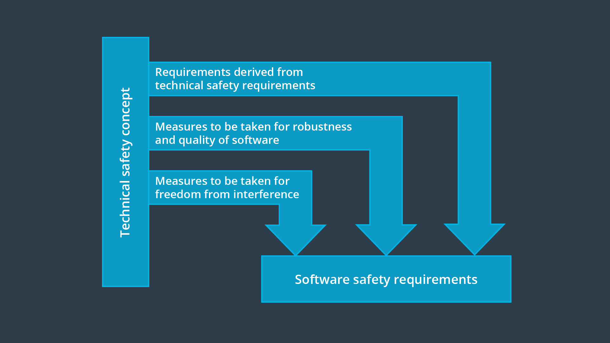

软件BUG是一个非常重要的错误来源，如果不是汽车功能安全方面的头号错误来源的话。您对安全关键软件了解得越多，您的软件安全需求就会越好。

## Software Robustness and Quality
需求中存在缺陷是事故的主要原因之一。该标准提供了许多关于如何开发安全重要软件的建议，例如，该标准讨论了除了技术安全要求之外的两个核心原则来驱动软件安全要求：
- 第一个原则是确保稳健性和质量
- 第二个原则是免于干涉

我们将首先讨论确保稳健性和质量，**鲁棒性**具体是指我们是否有软件面临嵌入式输入或stressful的环境条件。例如，无效输入可能是超出其允许范围的参数。

**质量**意味着软件可以满足其功能要求以及非功能性要求。如可维护性，适应性，可用性和性能。

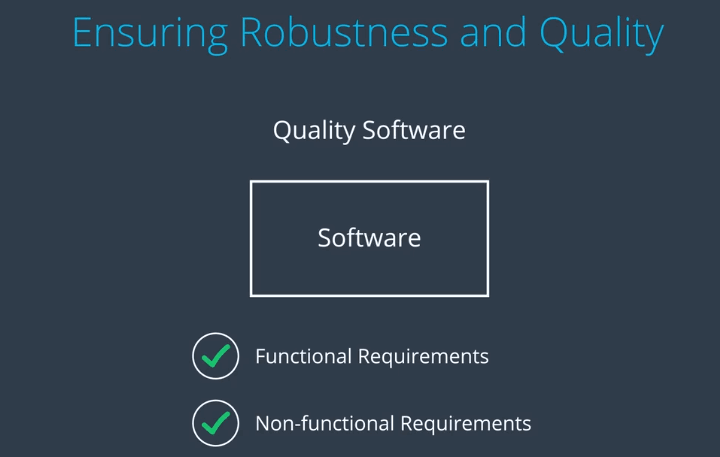

到目前为止，我们已经看到技术安全要求，以及质量和稳健性如何导致软件安全要求。接下来，我们将讨论免受干扰的软件安全要求，设备之间的干扰可能发生在V模型的任何级别。由于软件设备不能始终物理分离，软件干扰是一个特别重要的话题。不受干扰意味着一个软件设备不应导致其他软件设备出现故障，因此，软件被分割成单独的部分以便故障不会传播。

在软件设备具有相同ASIL情况下，ISO26262确实停止强制干涉。但是，当不同ASIL值的软件组件相互通信，或在同一ECU上运行时，你需要证明不受干扰。

为了确保软件设备不会相互干扰，我们需要了解三种类型的干扰，即空间、时间和通信干扰。

# 9. Freedom from Interference - Spatial

免受空间干扰意味着一个软件分区不应该更改另一个软件分区的代码或数据，换句话说，软件设备之间的内存和存储应该是分开的，否则，代码和数据可能会损坏。

实际上，你需要注意读取，写入和执行权限。

想想软件分区之间的关系是一种信任，高级设备不信任任何低级设备，所以ASIL D可以从QM设备中读取，然而ASIL D设备应该尽可能减少QM设备的读数，ASIL D设备也可以写入QM设备，但QM设备却只能读取ASIL D设备，关键设备不应写入较高的ASIL设备。

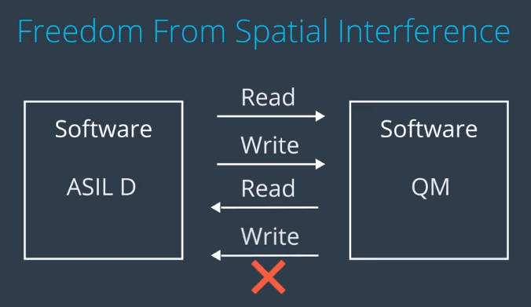

同样，如果QM设备能够执行由ASIL D设备提供的功能，但是ASIL D设备不会信任QM功能，并且不执行QM功能。

举一个具体的例子，如果QM设备中的软件漏洞错误地为ASIL C分区创建指针地址会发生什么？QM设备可能会写入一个ASIL C设备，这可能会导致违反安全目标，所以我们应该阻止或检测它。

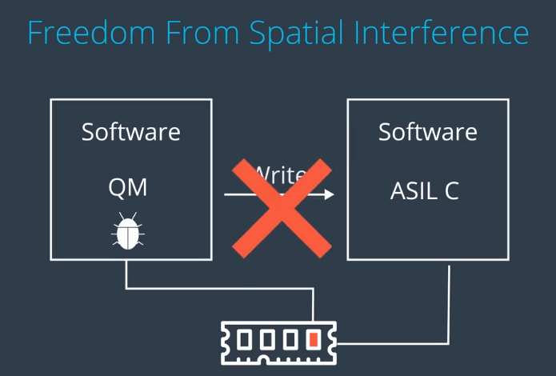

接下来，让我们讨论时间干扰。

## Mechanisms for Ensuring Freedom From Spatial Interference

有一些常见的机制可以确保不受空间干扰，比如MPU和相关数据的双重存储。
- MPU是一种预防方法，因为它阻止元素访问它们不应该访问的内存。可以对MPU进行编程，以便在软件元素之间设置正确的读、写和执行权限。
- 双存储相关数据，类似与2的补码是一种检测方法。使用2的补码，您可以检测到数据已经更改并且不再有效。但是你不能再使用这些数据了。

其他防止记忆干扰的机制包括:
- 冗余检查，如CRC，以确保数据不会意外更改。
- 具有内存错误检测和校正功能的微控制器
- 允许软件单元拥有自己的虚拟内存空间的操作系统

提到的一种机制是存储2的补码的安全相关数据。2的补码是二进制中表示负整数的一种方法。

CRC(循环冗余检查)是一种检查数据在传输过程中是否发生了更改的方法。它们的工作方式是向数据添加一个附加值，然后确保该值在传输过程中没有发生变化。

请注意，对于解决死锁，禁用会停止进程抢占的OS中断是低效的，并且可能会影响总体响应时间和系统延迟。另一种选择是由实时操作系统(RTOS)提供的Priority ceiling protocol。
> In real-time computing, the priority ceiling protocol is a synchronization protocol for shared resources to avoid unbounded priority inversion and mutual deadlock due to wrong nesting of critical sections. In this protocol each resource is assigned a priority ceiling, which is a priority equal to the highest priority of any task which may lock the resource. The protocol works by temporarily raising the priorities of tasks in certain situations, thus it requires a scheduler that supports dynamic priority scheduling.[1]

# 10. Freedom from Interference - Temporal
时间干扰是指随着时间的推移一个设备阻止另一个设备的执行。

例如，如果两个软件设备共享数据，更高优先级的线程可以连续访问数据，低优先级的线程则会一直等待，这被称为**阻止执行**。

还有许多其他时间干扰的例子，我们将讨论几个月。

当两个执行线程需要彼此资源时，会发生**死锁**。线程1拥有资源A需要资源B，线程2拥有资源B需要资源A。

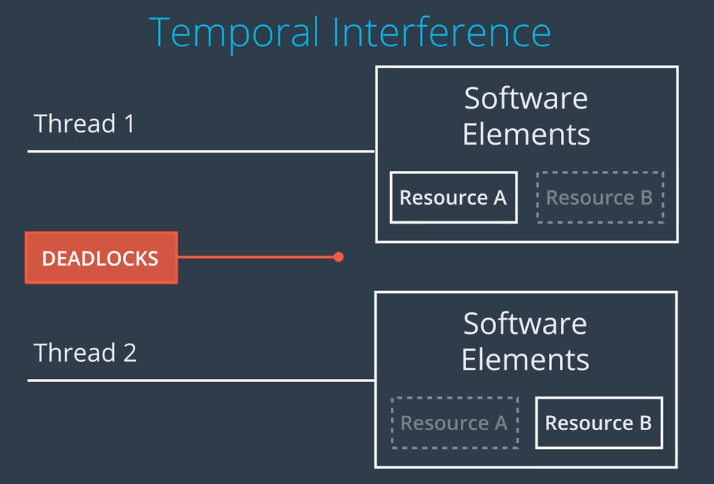

类似的干扰被称为**Livelocks**，两个线程想要相同的资源，在这种情况下，两个线程都有礼貌地让其他线程先行，但它们会搁置一边，然后同时获取资源。

时间干扰的另一个例子是软件系统之间的不正确同步。例如，考虑一辆自主车辆，有用于车辆检测的雷达系统和相机系统，每个系统都有自己的问题，但是如果有问题的时钟不能正确同步，那么传感器融合就无法完成。因为随着时间的推移将无法压缩信号。

因此，时钟需要同步或所有软件系统都需要使用相同的主时钟。

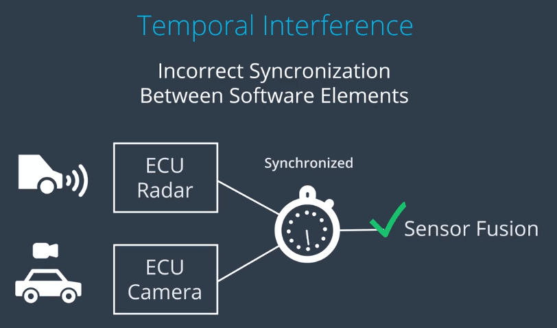

当发生任何时间或执行人相关的故障时，需要采取安全机制，这可能是功能退化，并最终过渡到安全状态以避免安全目标违规。

## Solving Deadlocks

有多种算法可以避免死锁，包括一种称为禁用中断的措施。当中断被启用时，一个进程可以中断另一个进程。在我们的例子中，线程1需要资源B，并试图获取A，但是线程2不断中断线程1来获取A。禁用中断将允许线程1获取A。

## Mechanisms for Freedom from Temporal Interference

避免时间干扰的机制包括循环执行调度、基于固定优先级的调度、时间触发调度、处理器执行时间监视、程序序列监视和到达率监视。

# 11. Freedom from Interference - Temporal Part 2

现在，我们来讨论执行时间的不正确分配和不正确的执行顺序。这些类型的时间干扰的发生条件为软件系统提前执行，推后执行或执行时间太长。功能安全标准建议三种不同的机制用于处理执行时间和执行顺序的故障，它们能实时监督，监测截止期限和控制流量。

所有这三种机制都与查验点一起协作。软件系统会在执行开始和结束时报告其状态.

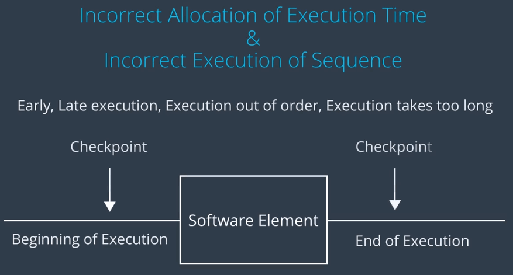

现场监督会限制给定时间段内软件系统的执行次数，当达到查验点时，系统会分析系统执行的次数。

截止日期监控考察软件系统执行需要多长时间，如果某个系统耗时过长，则会发生错误。

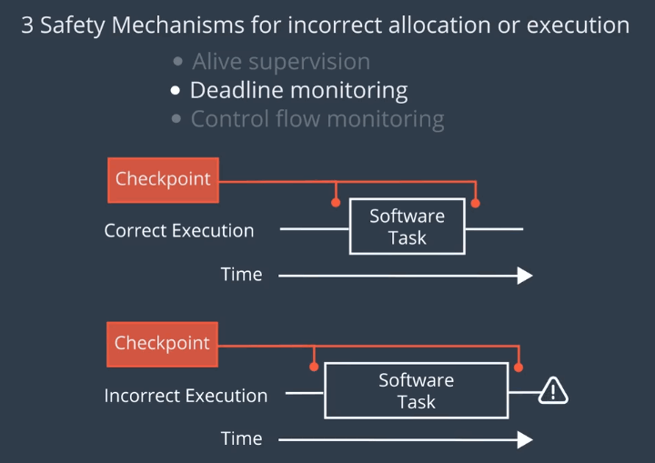

最后，控制流量监控确保软件进度按正确的顺序进行，例如，执行顺序可能无序或软件系统在顺序中间执行而非在开始时执行。

独立的软件块将包括在系统架构内用于分析查验点，如果发生违反安全目标的故障那么系统应该转换到安全状态。

# 13. Freedom from Interference - Communication
## Video
我们要讨论的最后一个干扰源是通信干扰,在车辆系统中软件设备需要交换电子控制单元之间的信息.即使发送者和接收者的ASIL相同,也有必要防止干扰.软件系统之间的通信渠道往往会有较低的ASIL或QM评级，受保护的通信通道将检测数据传输错误.

确保免受通讯干扰的最常见机制之一，被称为 E2E 或者端对端协议，E2E 协议可以帮助防止由于硬件，软件和电磁干扰导致的通信下降。该协议检查数据在传输过程中是否损坏，这样当数据损坏可能违反安全目标时，车辆可以被引导至安全状态。

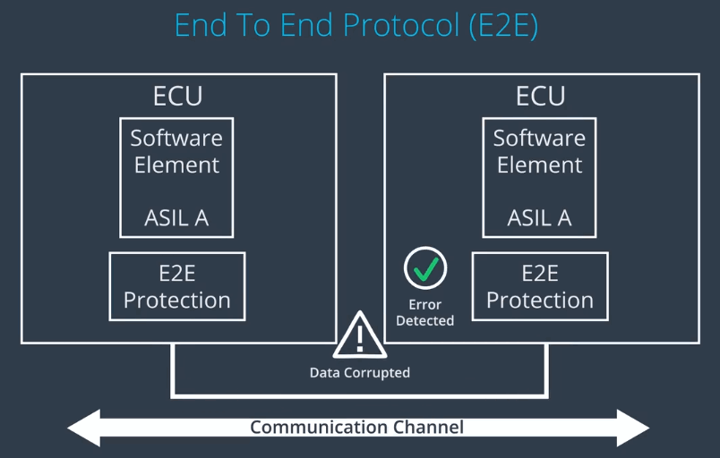

在车道偏离警告示例中，有一个技术安全要求可以采用 E2E 保护机制解决，其中一个要求是应确保LDW 扭矩请求信号数据传输的正确性和完整性。接下来我们将向你展示 如何将此要求细化为软件安全要求。

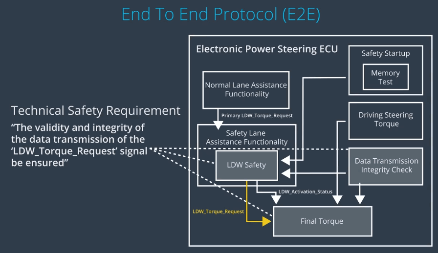

## 通讯干扰的常见原因
造成通信故障的原因有很多。这些原因将在软件安全分析或有时在技术安全分析中进行分析:
- Repetition of information（重复的信息）
- Loss of information （信息丢失）
- Delay of information （延迟的信息）
- Insertion of information  （插入的信息）
- Masquerade or incorrect addressing of information （伪装或不正确的信息寻址）
- Incorrect sequence of information （信息序列不正确）
- Corruption of information （污染的信息）

## 保障通讯不受干扰的其他机制
有一些方法可以避免通信干扰。这些机制可以用来定义有助于避免通信错误的软件安全需求。确保不受干涉的机制包括:
- Loopback of information （信息回环）
- Acknowledgement of information （信息确认）
- Appropriate configuration of I/O pins （I/O引脚的适当配置）
- Bus arbitration by priority （优先级总线仲裁)
- E2E protocol （E2E协议）

例如，一项技术安全要求是“确保‘LDW_Torque_Request’信号数据传输的有效性和完整性”。该技术安全要求可以细化为软件安全要求，即数据应受End2End机制的保护。

## E2E保护协议示例规范
下图显示了E2E协议的示例。

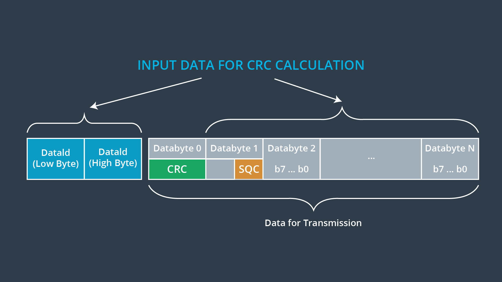

该机制涉及在传输数据时添加两个额外的数据字节，称为CRC(循环冗余检查)和SQC(序列计数器)。
- 要计算CRC，需要对要传输的数据运行一个数学公式。然后在传输之前将CRC结果附加到数据上。当接收到数据时，再次对数据集运行数学公式。数据所附的CRC值与接收端计算的CRC值相同;否则，数据数据可能在传输中已损坏。
- SQC只是一个与数据一起发送的计数器。这样接收者可以确保消息没有丢失。

## 车道偏离警告(LDW)的E2E软件安全要求
在“软件安全要求车道偏离警告”的概念中，我们已经讨论过使用E2E协议可以处理技术安全要求02。让我们更深入地了解这个技术需求和相关的软件安全需求。以下是技术安全要求:

ID | Technical Safety Requirement | ASIL | Fault Tolerant Time Interval | Allocation to Architecture | Safe State
------- | ------- | ------- | ------- | ------- | -------
TechnicalSafetyRequirement02 | The validity and integrity of the data transmission forLDW_Torque_Request signal shall be ensured | C | 50 ms | Data Transmission Integrity Check | N/A

这是软件安全架构图

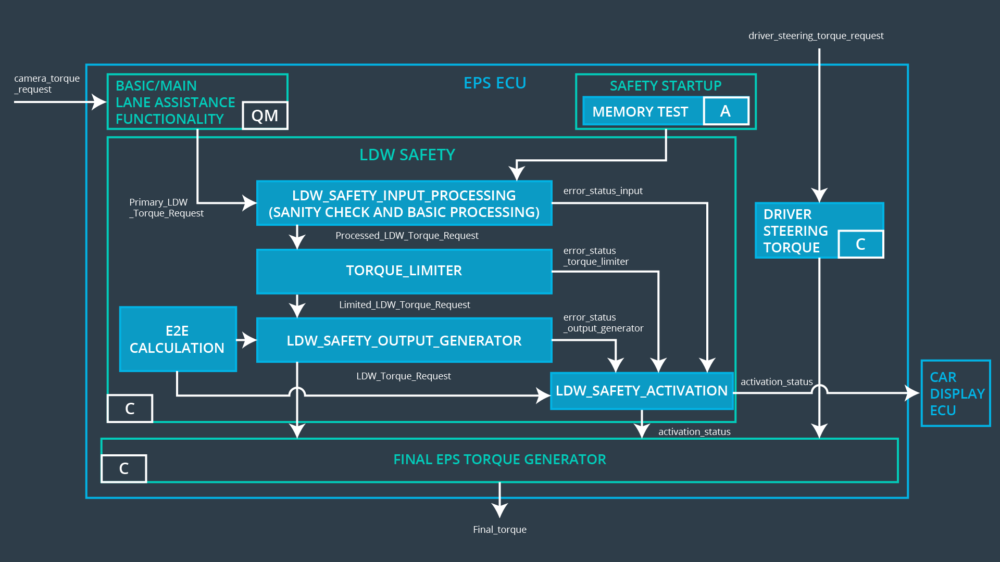

您可以看到，我们为离开LDW安全组件的两个信号添加了E2E计算。我们需要确保当“Processed_LDW_Torque_Request”信号传递到“最终EPS扭矩生成器”时没有损坏。E2E计算组件将对要传输的信号进行计算，并将计算附加到信号上。然后，“最终EPS转矩发生器”组件将运行相同的计算，并比较传输前后的结果。如果结果相同，则可以假设数据保持不变。当“LDW_Safety_Activation”组件将其信号发送到“Final EPS扭矩生成器”时，我们将使用相同的机制。下面是软件安全要求:

ID | Technical Safety Requirement | ASIL | Allocation Software Elements | Safe State
------- | ------- | ------- | ------- | -------
SoftwareSafetyRequirement02-01 | Any data to be transmitted outside of the LDW Safety component (“LDW Safety”) including "LDW_Torque_Req" and “activation_status” (see SofSafReq03-02) shall be protected by an End2End(E2E) protection mechanism | C | E2ECalc | LDW_Torq_Req= 0 (Nm)
SoftwareSafetyRequirement02-02 | The E2E protection protocol shall contain and attach the control data: alive counter (SQC) and CRC to the data to be transmitted. | C | E2ECalc | LDW_Torq_Req= 0 (Nm)

# 14. System Architecture Safety Design Patterns

## Video
设计模式是被证明的，成熟的架构。汽车行业最常见的软件模式之一称为 E-Gas，E-Gas 模式定义了三个软件级别。
- 第一级是包含系统预期功能的功能级别。对于之前课程中使用的车道辅助示例，预期功能将是将车轮转向中心，并根据摄像机数据调整方向盘。二级和三级 E-Gas 模式用于监控
- 二级模式指的是监控第一级的任何安全目标违规的**功能性监控**。例如，二级软件将监视车道辅助系统的时间和扭矩请求，我们在前面的课程中讨论过。
- 三级模式用于主要硬件组件的处理器监控。例如，三级软件启动监视 RAM ROM 和控制流

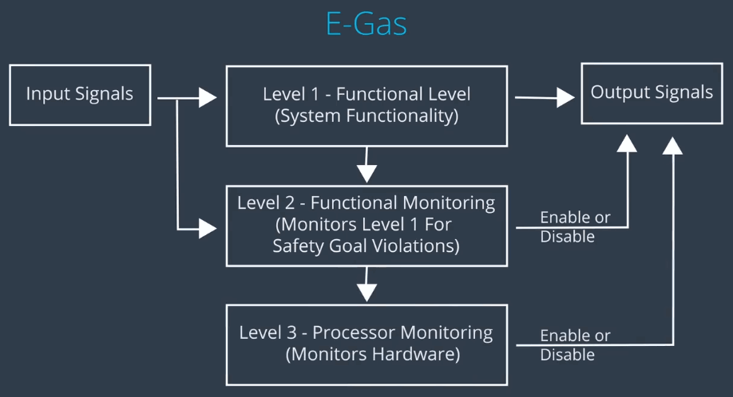

在我们的车道辅助例子中，一级软件会向方向盘马达发送扭矩请求.

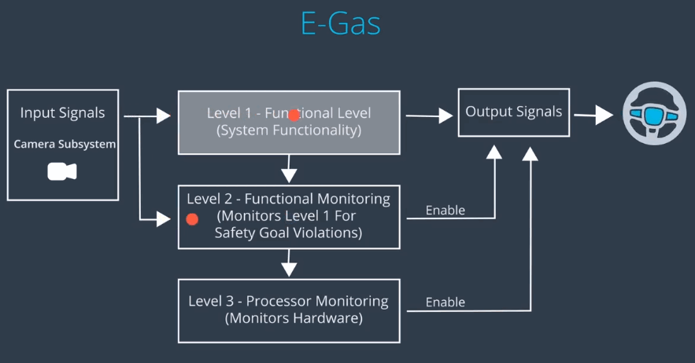

如果二级或三级软件检测到错误，那么一级软件被禁用，二级三级软件会使系统达到安全状态。在这种情况下 我们确定安全状态会发送零转矩输出。

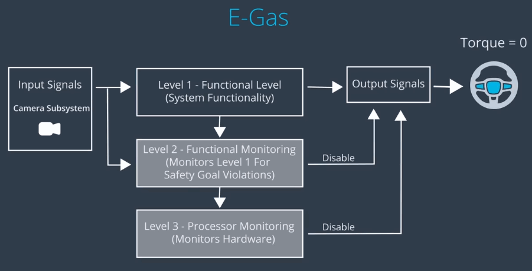

## E-gas这个名字从何而来?
E-gas的设计模式最初来自一个线控加速系统。最初，汽车上的油门踏板与发动机上的节流阀有直接的机械连接。节流阀调节进入发动机的空气量。在现代汽车中，油门踏板是一个电子传感器。当你踩下油门踏板时，软件会解释你想要加速多少。然后软件打开或关闭节流阀。开发了E-gas软件模式，用于监测线控加速度系统的故障。在汽油发动机系统故障的情况下，二级或三级监测功能可以降低油门。

## 软件分区和安全监控
安全监视和软件分区是通常使用设计模式解决的软件机制。对于安全监测，有一些特定的模式，如解释过的E-GAS概念。在软件分区的情况下，一种模式是使用称为MPU的硬件特性和双数据存储。

# 15. Lesson Summary

现在你已经看到了一些关于开发安全驱动的硬件和软件的主要问题。对于硬件，我们讨论了随机故障为什么不可避免，但可以尽量减少并检测得到。在软件方面，我们回顾了选择编程语言和软件工具的基本标准，我们还展示了V模型如何应用于软件开发。然后讨论了从技术安全要求中推导出软件安全要求。然后，我们看到了软件安全要求的其他来源，如鲁棒性，质量和免受干扰。重点是利用这些知识来降低风险并避免伤害，了解不同的故障来源可以让你制定更强大的安全要求并设计更安全的系统。

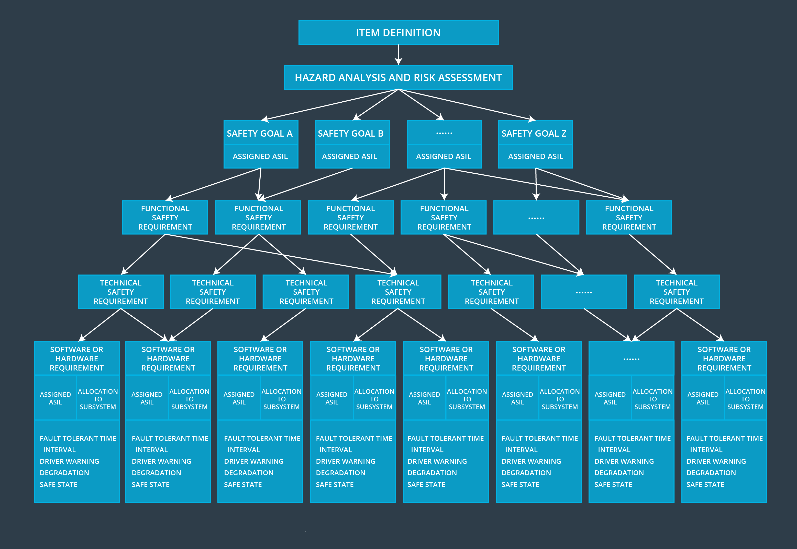

